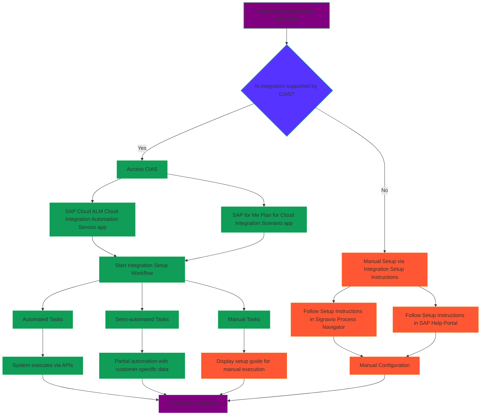

```mermaid
flowchart TB
    A[Integration Requirement Identified] --> B{Is integration supported by CIAS?}
    B -->|Yes| C[Access CIAS]
    B -->|No| D[Manual Setup via Integration Setup Instructions]
    
    C --> C1[SAP Cloud ALM Cloud Integration Automation Service app]
    C --> C2[SAP for Me Plan for Cloud Integration Scenario app]
    
    C1 --> E[Start Integration Setup Workflow]
    C2 --> E
    
    E --> F[Automated Tasks]
    E --> G[Semi-automated Tasks]
    E --> H[Manual Tasks]
    
    F --> F1[System executes via APIs]
    G --> G1[Partial automation with customer-specific data]
    H --> H1[Display setup guide for manual execution]
    
    F1 --> I[Integration Complete]
    G1 --> I
    H1 --> I
    
    D --> J[Follow Setup Instructions in Signavio Process Navigator]
    D --> K[Follow Setup Instructions in SAP Help Portal]
    
    J --> L[Manual Configuration]
    K --> L
    L --> I
    
    classDef start fill:#800080,stroke:#5d6d7e,stroke-width:2px;
    classDef decision fill:#5733FF,stroke:#2980b9,stroke-width:2px;
    classDef process fill:#0F9D58,stroke:#27ae60,stroke-width:1px;
    classDef manual fill:#FF5733,stroke:#e67e22,stroke-width:1px;
    classDef wend fill:#800080,stroke:#8e44ad,stroke-width:1px;
    
    class A start;
    class B decision;
    class C,C1,C2,E,F,G,H,F1,G1 process;
    class D,H1,J,K,L manual;
    class I wend;
```
