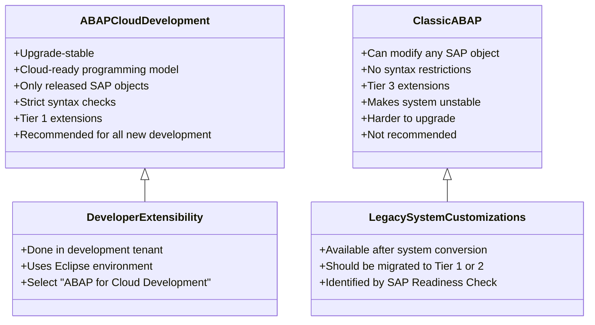

```mermaid
classDiagram
    class ABAP Cloud Development {
        +Upgrade-stable
        +Cloud-ready programming model
        +Only released SAP objects
        +Strict syntax checks
        +Tier 1 extensions
        +Recommended for all new development
    }
    
    class Classic ABAP {
        +Can modify any SAP object
        +No syntax restrictions
        +Tier 3 extensions
        +Makes system unstable
        +Harder to upgrade
        +Not recommended
    }
    
    ABAP Cloud Development <|-- Developer Extensibility
    Classic ABAP <|-- Legacy System Customizations
    
    class Developer Extensibility {
        +Done in development tenant
        +Uses Eclipse environment
        +Select "ABAP for Cloud Development"
    }
    
    class Legacy System Customizations {
        +Available after system conversion
        +Should be migrated to Tier 1 or 2
        +Identified by SAP Readiness Check
    }
```
