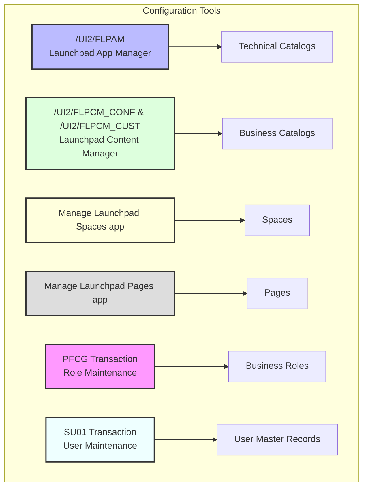

```mermaid
flowchart TD
    subgraph "Configuration Tools"
        FLPAM["/UI2/FLPAM<br>Launchpad App Manager"] --> TechCat[Technical Catalogs]
        FLPCM["/UI2/FLPCM_CONF & /UI2/FLPCM_CUST<br>Launchpad Content Manager"] --> BusCat[Business Catalogs]
        MLS[Manage Launchpad Spaces app] --> Spaces[Spaces]
        MLP[Manage Launchpad Pages app] --> Pages[Pages]
        PFCG[PFCG Transaction<br>Role Maintenance] --> Roles[Business Roles]
        SU01[SU01 Transaction<br>User Maintenance] --> Users[User Master Records]
    end
    
    style FLPAM fill:#bbf,stroke:#333,stroke-width:2px
    style FLPCM fill:#dfd,stroke:#333,stroke-width:2px
    style MLS fill:#ffd,stroke:#333,stroke-width:2px
    style MLP fill:#ddd,stroke:#333,stroke-width:2px
    style PFCG fill:#f9f,stroke:#333,stroke-width:2px
    style SU01 fill:#eff,stroke:#333,stroke-width:2px
```
