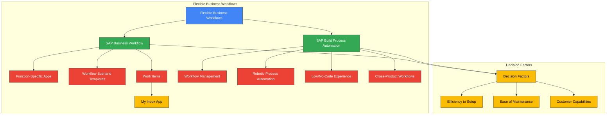

```mermaid
flowchart TB
    subgraph "Flexible Business Workflows"
        FBW[Flexible Business Workflows] --> SBW[SAP Business Workflow]
        FBW --> SBPA[SAP Build Process Automation]
        
        SBW --> SBWF[Function-Specific Apps]
        SBW --> SWST[Workflow Scenario Templates]
        SBW --> WI[Work Items]
        WI --> MI[My Inbox App]
        
        SBPA --> WM[Workflow Management]
        SBPA --> RPA[Robotic Process Automation]
        SBPA --> LNCE[Low/No-Code Experience]
        SBPA --> CPW[Cross-Product Workflows]
    end
    
    subgraph "Decision Factors"
        DF[Decision Factors] --> ES[Efficiency to Setup]
        DF --> EM[Ease of Maintenance]
        DF --> CC[Customer Capabilities]
    end
    
    SBW --> DF
    SBPA --> DF
    
    classDef primary fill:#4285F4,stroke:#333,stroke-width:1px,color:white
    classDef secondary fill:#34A853,stroke:#333,stroke-width:1px,color:white
    classDef tertiary fill:#EA4335,stroke:#333,stroke-width:1px,color:white
    classDef quaternary fill:#FBBC05,stroke:#333,stroke-width:1px,color:black
    
    class FBW primary
    class SBW,SBPA secondary
    class SBWF,SWST,WI,WM,RPA,LNCE,CPW tertiary
    class MI,DF,ES,EM,CC quaternary
```
