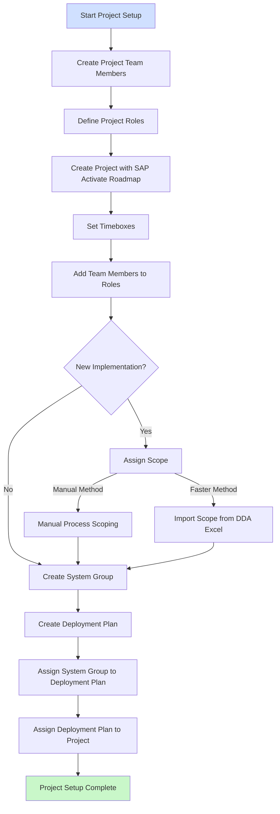

```mermaid
flowchart TD
    A[Start Project Setup] --> B[Create Project Team Members]
    B --> C[Define Project Roles]
    C --> D[Create Project with SAP Activate Roadmap]
    D --> E[Set Timeboxes]
    E --> F[Add Team Members to Roles]
    
    F --> G{New Implementation?}
    G -->|Yes| H[Assign Scope]
    G -->|No| J[Create System Group]
    
    H -->|Manual Method| I1[Manual Process Scoping]
    H -->|Faster Method| I2[Import Scope from DDA Excel]
    
    I1 --> J
    I2 --> J
    
    J --> K[Create Deployment Plan]
    K --> L[Assign System Group to Deployment Plan]
    L --> M[Assign Deployment Plan to Project]
    M --> N[Project Setup Complete]
    
    style A fill:#d0e0ff
    style N fill:#c9f7c9
```
