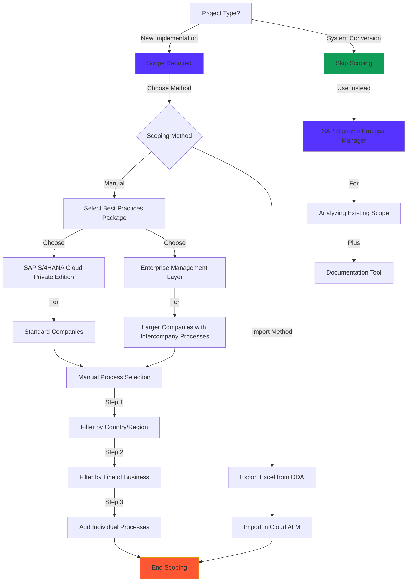

```mermaid
flowchart TD
    A[Project Type?] -->|New Implementation| B[Scope Required]
    A -->|System Conversion| C[Skip Scoping]
    
    B -->|Choose Method| D{Scoping Method}
    
    D -->|Manual| E[Select Best Practices Package]
    E -->|Choose| E1[SAP S/4HANA Cloud Private Edition]
    E -->|Choose| E2[Enterprise Management Layer]
    
    E1 -->|For| F1[Standard Companies]
    E2 -->|For| F2[Larger Companies with Intercompany Processes]
    
    F1 --> G[Manual Process Selection]
    F2 --> G
    
    G -->|Step 1| H[Filter by Country/Region]
    H -->|Step 2| I[Filter by Line of Business]
    I -->|Step 3| J[Add Individual Processes]
    J --> K[End Scoping]
    
    D -->|Import Method| L[Export Excel from DDA]
    L --> M[Import in Cloud ALM]
    M --> K
    
    C -->|Use Instead| N[SAP Signavio Process Manager]
    N -->|For| O[Analyzing Existing Scope]
    O -->|Plus| P[Documentation Tool]
    
    style B fill:#5733FF,stroke:#6c8ebf
    style C fill:#0F9D58,stroke:#82b366
    style K fill:#FF5733,stroke:#d79b00
    style N fill:#5733FF,stroke:#9673a6
```
