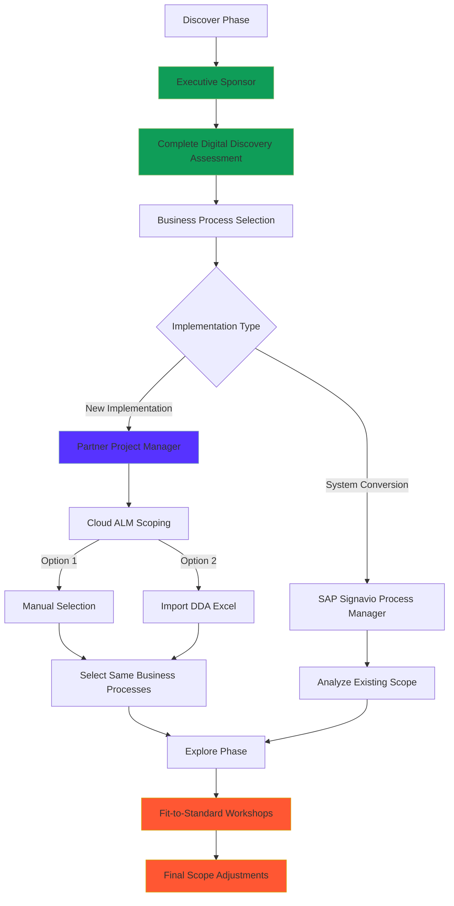

```mermaid
flowchart TD
    A[Discover Phase] --> B[Executive Sponsor]
    B --> C[Complete Digital Discovery Assessment]
    C --> D[Business Process Selection]
    
    D --> E{Implementation Type}
    
    E -->|New Implementation| F[Partner Project Manager]
    F --> G1[Cloud ALM Scoping]
    
    G1 -->|Option 1| H1[Manual Selection]
    G1 -->|Option 2| H2[Import DDA Excel]
    
    H1 --> I[Select Same Business Processes]
    H2 --> I
    
    E -->|System Conversion| J[SAP Signavio Process Manager]
    J --> K[Analyze Existing Scope]
    
    I --> L[Explore Phase]
    K --> L
    
    L --> M[Fit-to-Standard Workshops]
    M --> N[Final Scope Adjustments]
    
    style B fill:#0F9D58,stroke:#82b366
    style C fill:#0F9D58,stroke:#82b366
    style F fill:#5733FF,stroke:#6c8ebf
    style M fill:#FF5733,stroke:#d79b00
    style N fill:#FF5733,stroke:#d79b00
```
