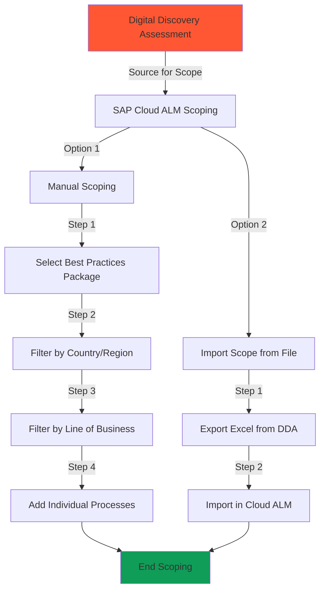

```mermaid
flowchart TD
    A[Digital Discovery Assessment] -->|Source for Scope| B[SAP Cloud ALM Scoping]
    
    B -->|Option 1| C[Manual Scoping]
    C -->|Step 1| D[Select Best Practices Package]
    D -->|Step 2| E[Filter by Country/Region]
    E -->|Step 3| F[Filter by Line of Business]
    F -->|Step 4| G[Add Individual Processes]
    G --> H[End Scoping]
    
    B -->|Option 2| I[Import Scope from File]
    I -->|Step 1| J[Export Excel from DDA]
    J -->|Step 2| K[Import in Cloud ALM]
    K --> H
    
    style A fill:#FF5733
    style H fill:#0F9D58
```
