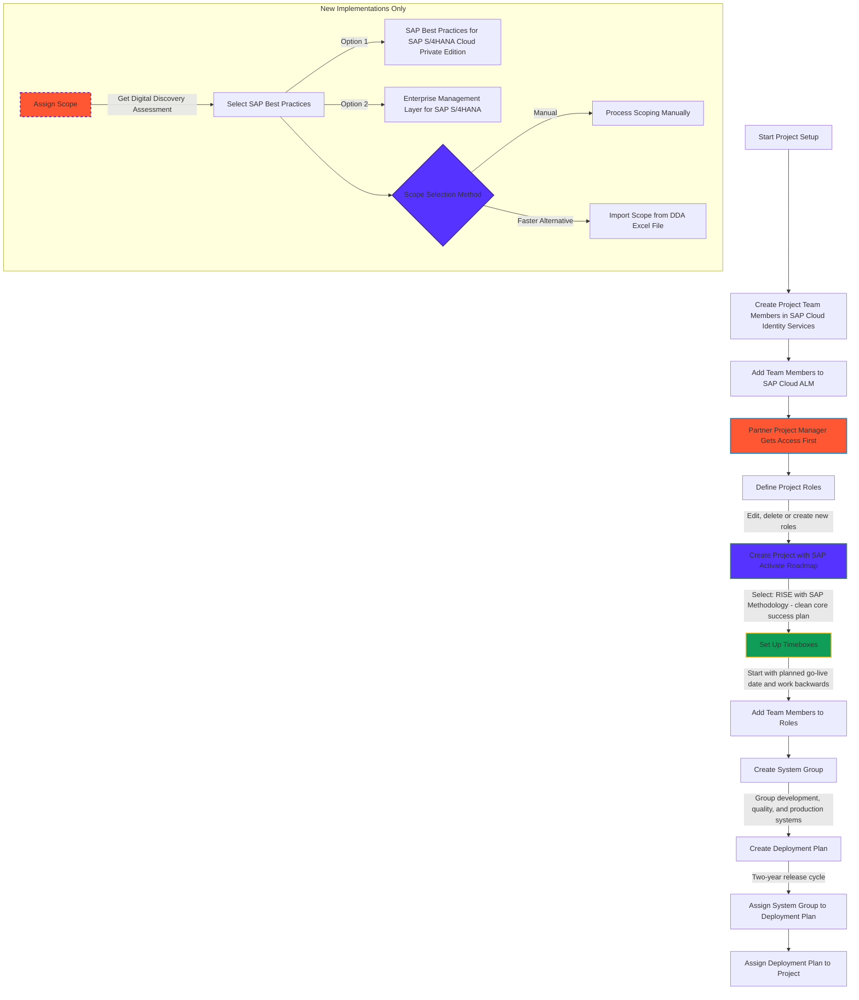

```mermaid
flowchart TD
    A[Start Project Setup] --> B[Create Project Team Members in SAP Cloud Identity Services]
    B --> C[Add Team Members to SAP Cloud ALM]
    C --> D[Partner Project Manager Gets Access First]
    
    D --> E[Define Project Roles]
    E -->|Edit, delete or create new roles| F[Create Project with SAP Activate Roadmap]
    F -->|Select: RISE with SAP Methodology - clean core success plan| G[Set Up Timeboxes]
    G -->|Start with planned go-live date and work backwards| H[Add Team Members to Roles]
    
    subgraph "New Implementations Only"
        I[Assign Scope] -->|Get Digital Discovery Assessment| J[Select SAP Best Practices]
        J -->|Option 1| K[SAP Best Practices for SAP S/4HANA Cloud Private Edition]
        J -->|Option 2| L[Enterprise Management Layer for SAP S/4HANA]
        J --> M{Scope Selection Method}
        M -->|Manual| N[Process Scoping Manually]
        M -->|Faster Alternative| O[Import Scope from DDA Excel File]
    end
    
    H --> P[Create System Group]
    P -->|Group development, quality, and production systems| Q[Create Deployment Plan]
    Q -->|Two-year release cycle| R[Assign System Group to Deployment Plan]
    R --> S[Assign Deployment Plan to Project]
    
    style D fill:#FF5733,stroke:#0288d1,stroke-width:2px
    style F fill:#5733FF,stroke:#388e3c,stroke-width:2px
    style G fill:#0F9D58,stroke:#fbc02d,stroke-width:2px
    style I fill:#FF5733,stroke:#7b1fa2,stroke-width:2px,stroke-dasharray: 5 5
    style M fill:#5733FF,stroke:#4527a0,stroke-width:2px
```
