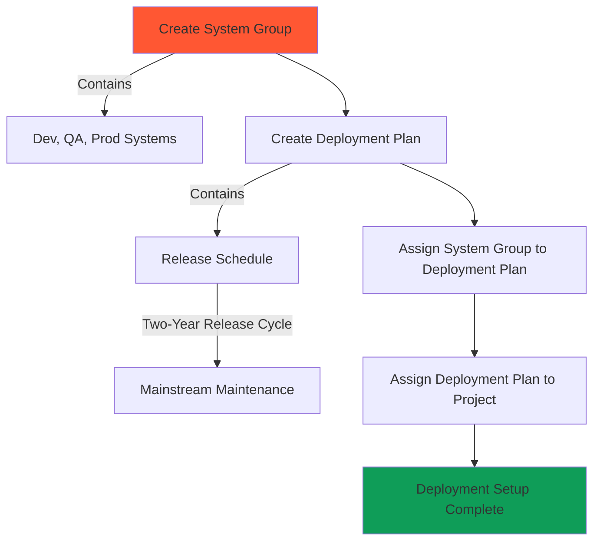

```mermaid
flowchart TD
    A[Create System Group] -->|Contains| B[Dev, QA, Prod Systems]
    A --> C[Create Deployment Plan]
    C -->|Contains| D[Release Schedule]
    D -->|Two-Year Release Cycle| E[Mainstream Maintenance]
    
    C --> F[Assign System Group to Deployment Plan]
    F --> G[Assign Deployment Plan to Project]
    G --> H[Deployment Setup Complete]
    
    style A fill:#FF5733
    style H fill:#0F9D58
```
