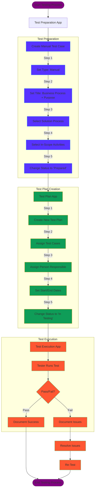

```mermaid
flowchart TB
    Start([Start Testing Process]) --> TestPrep[Test Preparation App]
    TestPrep --> CreateTest[Create Manual Test Case]
    
    subgraph "Test Preparation"
        CreateTest --> |Step 1| Type["Set Type: Manual"]
        Type --> |Step 2| Title["Set Title: Business Process + Purpose"]
        Title --> |Step 3| Scope["Select Solution Process"]
        Scope --> |Step 4| Activities["Select In-Scope Activities"]
        Activities --> |Step 5| StatusPrep["Change Status to 'Prepared'"]
    end
    
    StatusPrep --> TestPlan[Test Plan App]
    
    subgraph "Test Plan Creation"
        TestPlan --> |Step 1| CreatePlan["Create New Test Plan"]
        CreatePlan --> |Step 2| AssignCase["Assign Test Cases"]
        AssignCase --> |Step 3| AssignTester["Assign Person Responsible"]
        AssignTester --> |Step 4| SetDates["Set Start/End Dates"]
        SetDates --> |Step 5| StatusTest["Change Status to 'In Testing'"]
    end
    
    StatusTest --> Execution[Test Execution App]
    
    subgraph "Test Execution"
        Execution --> RunTest["Tester Runs Test"]
        RunTest --> Results{"Pass/Fail?"}
        Results --> |Pass| DocumentPass["Document Success"]
        Results --> |Fail| DocumentIssue["Document Issues"]
    end
    
    DocumentPass --> End([End Testing Process])
    DocumentIssue --> ResolveFix["Resolve Issues"]
    ResolveFix --> Retest["Re-Test"]
    Retest --> End
    
    classDef prepSteps fill:#5733FF,stroke:#2196f3,stroke-width:1px
    classDef planSteps fill:#0F9D58,stroke:#ff9800,stroke-width:1px
    classDef execSteps fill:#FF5733,stroke:#4caf50,stroke-width:1px
    classDef endpoints fill:#800080,stroke:#9e9e9e,stroke-width:1px
    
    class Start,End endpoints
    class CreateTest,Type,Title,Scope,Activities,StatusPrep prepSteps
    class TestPlan,CreatePlan,AssignCase,AssignTester,SetDates,StatusTest planSteps
    class Execution,RunTest,Results,DocumentPass,DocumentIssue,ResolveFix,Retest execSteps
```
