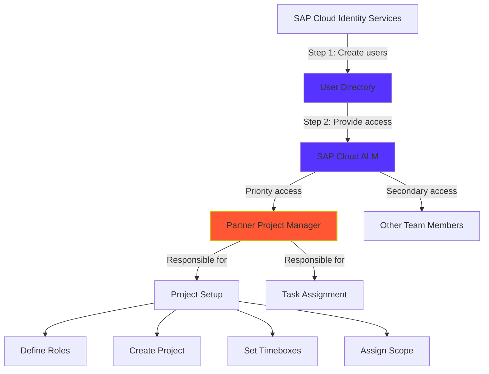

```mermaid
flowchart TD
    A[SAP Cloud Identity Services] -->|Step 1: Create users| B[User Directory]
    B -->|Step 2: Provide access| C[SAP Cloud ALM]
    C -->|Priority access| D[Partner Project Manager]
    C -->|Secondary access| E[Other Team Members]
    
    D -->|Responsible for| F[Project Setup]
    D -->|Responsible for| G[Task Assignment]
    
    F --> H[Define Roles]
    F --> I[Create Project]
    F --> J[Set Timeboxes]
    F --> K[Assign Scope]
    
    style D fill:#FF5733,stroke:#d9b000,stroke-width:2px
    style B fill:#5733FF
    style C fill:#5733FF
```
