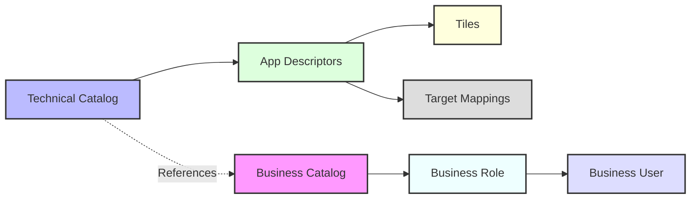

```mermaid
flowchart LR
    TechCat[Technical Catalog] --> AppDesc[App Descriptors]
    AppDesc --> Tiles[Tiles]
    AppDesc --> TargetMap[Target Mappings]
    TechCat -.References.-> BusCat[Business Catalog]
    BusCat --> Role[Business Role]
    Role --> User[Business User]
    
    style TechCat fill:#bbf,stroke:#333,stroke-width:2px
    style AppDesc fill:#dfd,stroke:#333,stroke-width:2px
    style Tiles fill:#ffd,stroke:#333,stroke-width:2px
    style TargetMap fill:#ddd,stroke:#333,stroke-width:2px
    style BusCat fill:#f9f,stroke:#333,stroke-width:2px
    style Role fill:#eff,stroke:#333,stroke-width:2px
    style User fill:#ddf,stroke:#333,stroke-width:2px
```
