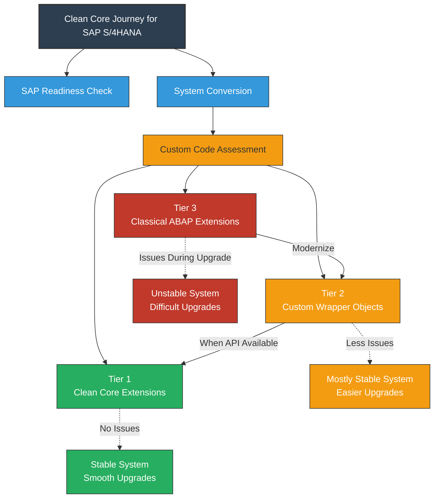

```mermaid
flowchart TB
    Root["Clean Core Journey for SAP S/4HANA"]
    
    Root --> RC["SAP Readiness Check"]
    Root --> SC["System Conversion"]
    SC --> Assessment["Custom Code Assessment"]
    
    Assessment --> T3["Tier 3<br>Classical ABAP Extensions"]
    Assessment --> T2["Tier 2<br>Custom Wrapper Objects"]
    Assessment --> T1["Tier 1<br>Clean Core Extensions"]
    
    T3 -->|"Modernize"| T2
    T2 -->|"When API Available"| T1
    
    T3 -.->|"Issues During Upgrade"| Unstable["Unstable System<br>Difficult Upgrades"]
    T2 -.->|"Less Issues"| MostlyStable["Mostly Stable System<br>Easier Upgrades"]
    T1 -.->|"No Issues"| Stable["Stable System<br>Smooth Upgrades"]
    
    style Root fill:#2c3e50,stroke:#333,stroke-width:2px,color:white
    style RC fill:#3498db,stroke:#333,stroke-width:1px,color:white
    style SC fill:#3498db,stroke:#333,stroke-width:1px,color:white
    style Assessment fill:#f39c12,stroke:#333,stroke-width:1px
    
    style T1 fill:#27ae60,stroke:#333,stroke-width:1px,color:white
    style T2 fill:#f39c12,stroke:#333,stroke-width:1px,color:white
    style T3 fill:#c0392b,stroke:#333,stroke-width:1px,color:white
    
    style Stable fill:#27ae60,stroke:#333,stroke-width:1px,color:white
    style MostlyStable fill:#f39c12,stroke:#333,stroke-width:1px,color:white
    style Unstable fill:#c0392b,stroke:#333,stroke-width:1px,color:white
```
