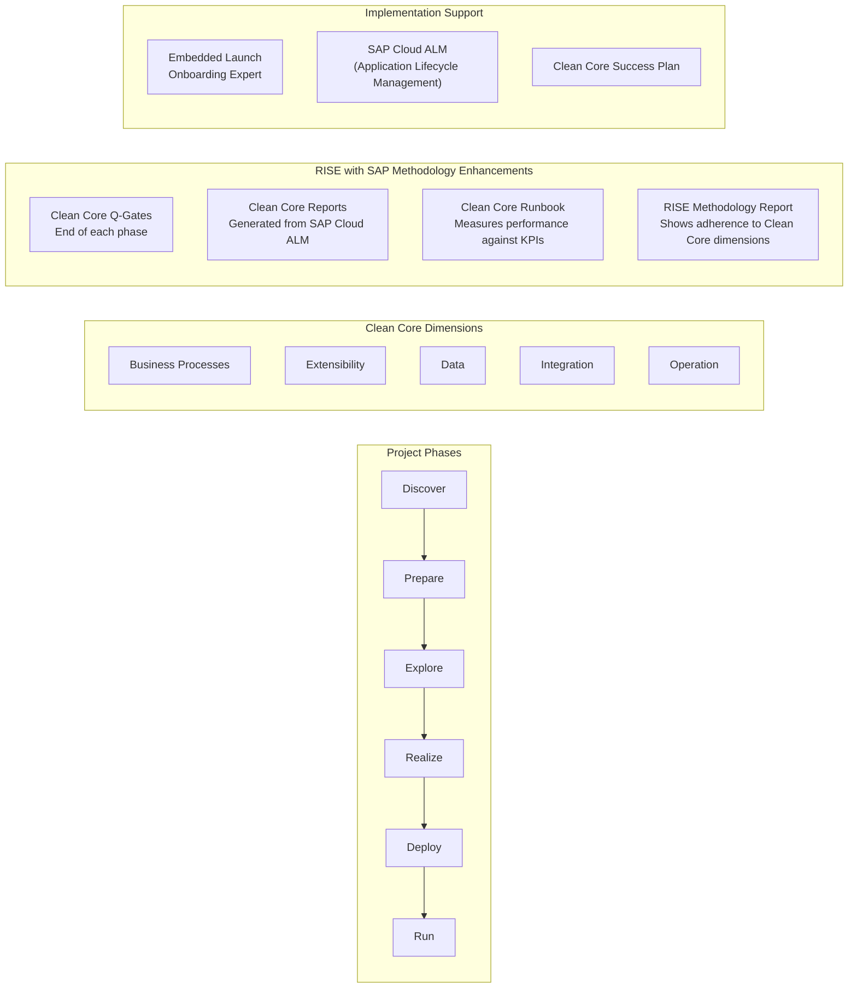

```mermaid
flowchart LR
    subgraph "Project Phases"
        discover["Discover"] --> prepare["Prepare"] --> explore["Explore"] --> realize["Realize"] --> deploy["Deploy"] --> run["Run"]
    end
    
    subgraph "Clean Core Dimensions"
        bp["Business Processes"]
        ext["Extensibility"]
        data["Data"]
        int["Integration"]
        op["Operation"]
    end
    
    subgraph "RISE with SAP Methodology Enhancements"
        qg["Clean Core Q-Gates<br/>End of each phase"]
        cr["Clean Core Reports<br/>Generated from SAP Cloud ALM"]
        crb["Clean Core Runbook<br/>Measures performance against KPIs"]
        mr["RISE Methodology Report<br/>Shows adherence to Clean Core dimensions"]
    end
    
    subgraph "Implementation Support"
        eloe["Embedded Launch<br/>Onboarding Expert"]
        calm["SAP Cloud ALM<br/>(Application Lifecycle Management)"]
        ccsp["Clean Core Success Plan"]
    end
```
