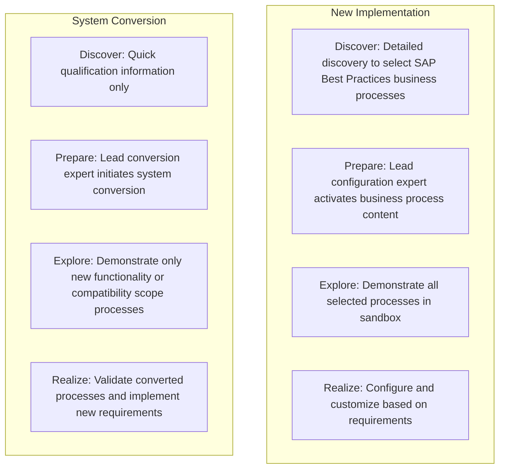

```mermaid
flowchart TB
    subgraph "New Implementation"
        NewDiscover["Discover: Detailed discovery to select SAP Best Practices business processes"]
        NewPrepare["Prepare: Lead configuration expert activates business process content"]
        NewExplore["Explore: Demonstrate all selected processes in sandbox"]
        NewRealize["Realize: Configure and customize based on requirements"]
    end
    
    subgraph "System Conversion"
        ConvDiscover["Discover: Quick qualification information only"]
        ConvPrepare["Prepare: Lead conversion expert initiates system conversion"]
        ConvExplore["Explore: Demonstrate only new functionality or compatibility scope processes"]
        ConvRealize["Realize: Validate converted processes and implement new requirements"]
    end
```
