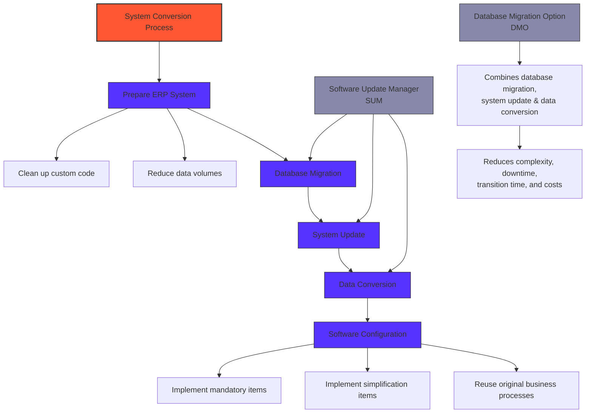

```mermaid
graph TD
    A[System Conversion Process] --> B[Prepare ERP System]
    B --> B1[Clean up custom code]
    B --> B2[Reduce data volumes]
    B --> C[Database Migration]
    C --> D[System Update]
    D --> E[Data Conversion]
    E --> F[Software Configuration]
    F --> F1[Implement mandatory items]
    F --> F2[Implement simplification items]
    F --> F3[Reuse original business processes]
    
    G[Software Update Manager\nSUM] --> C
    G --> D
    G --> E
    
    H[Database Migration Option\nDMO] --> H1[Combines database migration,\nsystem update & data conversion]
    H1 --> H2[Reduces complexity, downtime,\ntransition time, and costs]
    
    style A fill:#FF5733,stroke:#333,stroke-width:2px
    style B fill:#5733FF,stroke:#333
    style C fill:#5733FF,stroke:#333
    style D fill:#5733FF,stroke:#333
    style E fill:#5733FF,stroke:#333
    style F fill:#5733FF,stroke:#333
    style G fill:#8888aa,stroke:#333
    style H fill:#8888aa,stroke:#333
```
