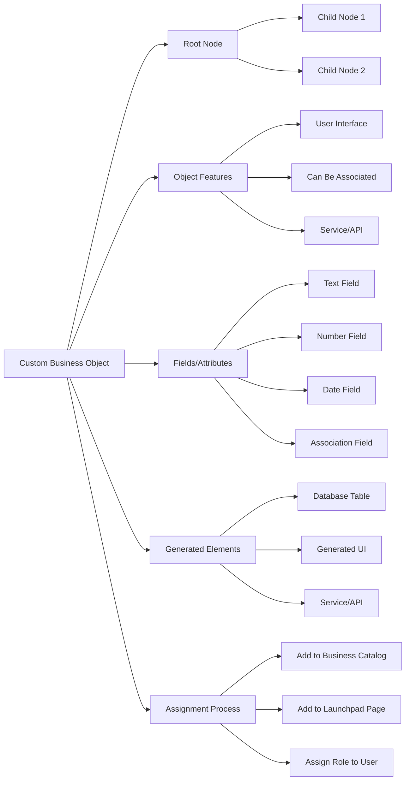

```mermaid
graph LR
    A[Custom Business Object] --> B[Root Node]
    B --> C[Child Node 1]
    B --> D[Child Node 2]
    
    A --> E[Object Features]
    E --> E1[User Interface]
    E --> E2[Can Be Associated]
    E --> E3[Service/API]
    
    A --> F[Fields/Attributes]
    F --> F1[Text Field]
    F --> F2[Number Field]
    F --> F3[Date Field]
    F --> F4[Association Field]
    
    A --> G[Generated Elements]
    G --> G1[Database Table]
    G --> G2[Generated UI]
    G --> G3[Service/API]
    
    A --> H[Assignment Process]
    H --> H1[Add to Business Catalog]
    H --> H2[Add to Launchpad Page]
    H --> H3[Assign Role to User]
```
