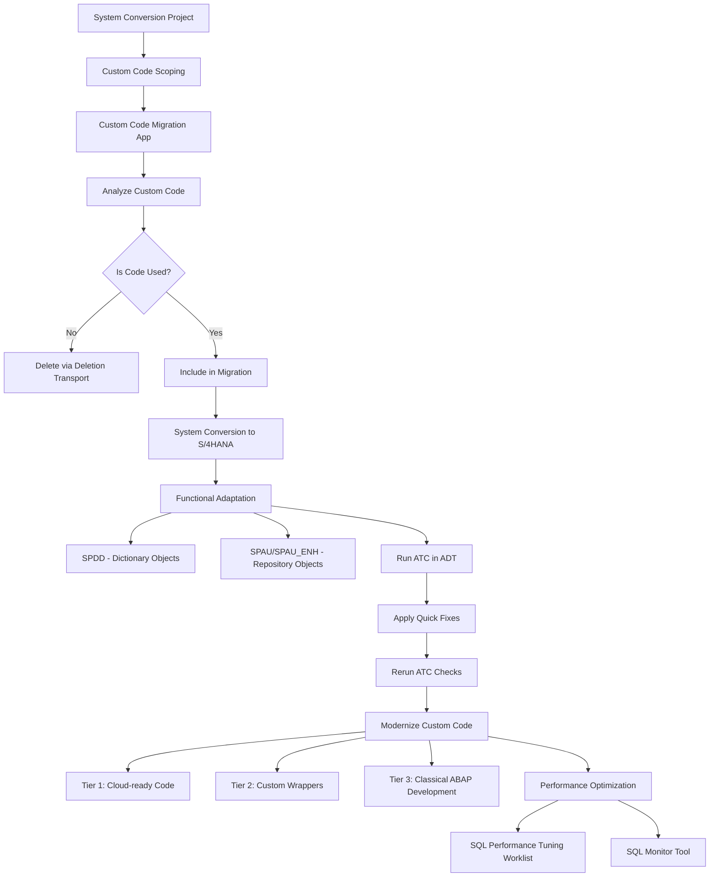

```mermaid
flowchart TD
    A[System Conversion Project] --> B[Custom Code Scoping]
    B --> C[Custom Code Migration App]
    C --> D[Analyze Custom Code]
    D --> E{Is Code Used?}
    E -->|No| F[Delete via Deletion Transport]
    E -->|Yes| G[Include in Migration]
    G --> H[System Conversion to S/4HANA]
    H --> I[Functional Adaptation]
    I --> I1[SPDD - Dictionary Objects]
    I --> I2[SPAU/SPAU_ENH - Repository Objects]
    I --> I3[Run ATC in ADT]
    I3 --> J[Apply Quick Fixes]
    J --> K[Rerun ATC Checks]
    K --> L[Modernize Custom Code]
    L --> L1[Tier 1: Cloud-ready Code]
    L --> L2[Tier 2: Custom Wrappers]
    L --> L3[Tier 3: Classical ABAP Development]
    L --> M[Performance Optimization]
    M --> M1[SQL Performance Tuning Worklist]
    M --> M2[SQL Monitor Tool]
```
