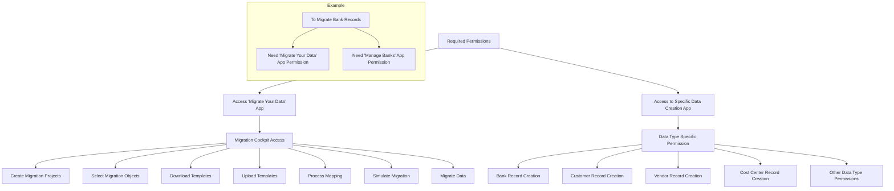

```mermaid
flowchart TD
    A["Required Permissions"] --> B["Access 'Migrate Your Data' App"]
    A --> C["Access to Specific Data Creation App"]
    
    B --> D["Migration Cockpit Access"]
    C --> E["Data Type Specific Permission"]
    
    D --> F["Create Migration Projects"]
    D --> G["Select Migration Objects"]
    D --> H["Download Templates"]
    D --> I["Upload Templates"]
    D --> J["Process Mapping"]
    D --> K["Simulate Migration"]
    D --> L["Migrate Data"]
    
    E --> M["Bank Record Creation"]
    E --> N["Customer Record Creation"]
    E --> O["Vendor Record Creation"]
    E --> P["Cost Center Record Creation"]
    E --> Q["Other Data Type Permissions"]
    
    subgraph "Example"
        direction TB
        R["To Migrate Bank Records"] --> S["Need 'Migrate Your Data' App Permission"]
        R --> T["Need 'Manage Banks' App Permission"]
    end
```
