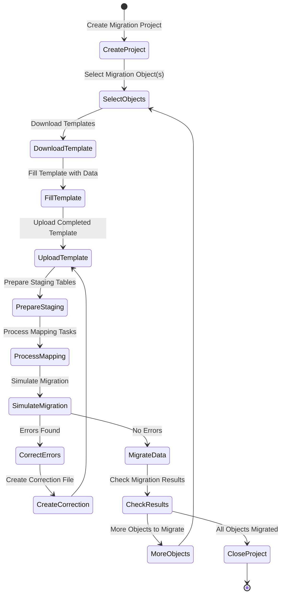

```mermaid
stateDiagram-v2
    [*] --> CreateProject: Create Migration Project
    CreateProject --> SelectObjects: Select Migration Object(s)
    SelectObjects --> DownloadTemplate: Download Templates
    DownloadTemplate --> FillTemplate: Fill Template with Data
    FillTemplate --> UploadTemplate: Upload Completed Template
    UploadTemplate --> PrepareStaging: Prepare Staging Tables
    PrepareStaging --> ProcessMapping: Process Mapping Tasks
    ProcessMapping --> SimulateMigration: Simulate Migration
    SimulateMigration --> CorrectErrors: Errors Found
    SimulateMigration --> MigrateData: No Errors
    CorrectErrors --> CreateCorrection: Create Correction File
    CreateCorrection --> UploadTemplate
    MigrateData --> CheckResults: Check Migration Results
    CheckResults --> MoreObjects: More Objects to Migrate
    CheckResults --> CloseProject: All Objects Migrated
    MoreObjects --> SelectObjects
    CloseProject --> [*]
```
