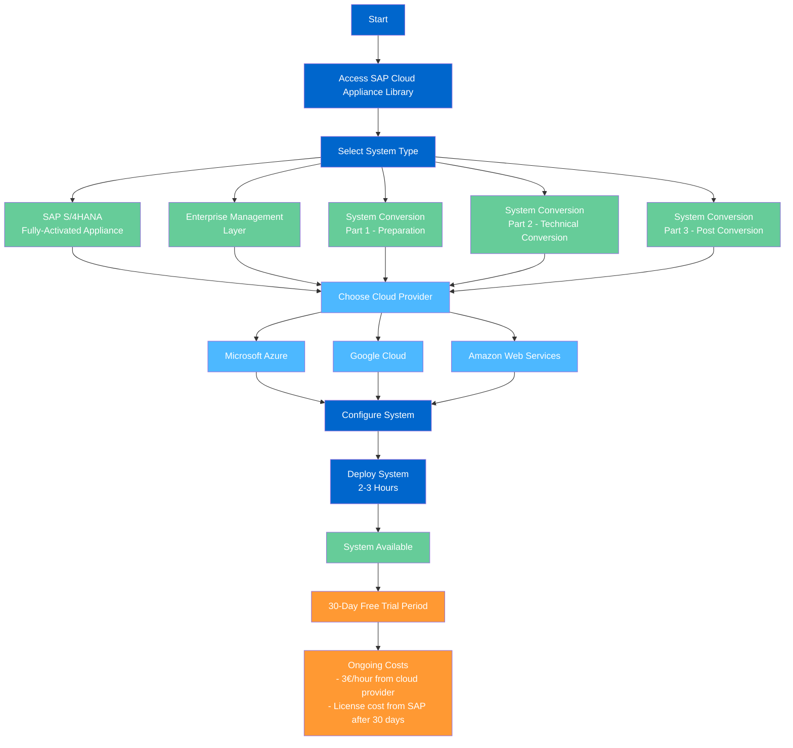

```mermaid
flowchart TD
    A[Start] --> B[Access SAP Cloud Appliance Library]
    B --> C[Select System Type]
    
    C --> D1[SAP S/4HANA\nFully-Activated Appliance]
    C --> D2[Enterprise Management\nLayer]
    C --> D3[System Conversion\nPart 1 - Preparation]
    C --> D4[System Conversion\nPart 2 - Technical Conversion]
    C --> D5[System Conversion\nPart 3 - Post Conversion]
    
    D1 --> E[Choose Cloud Provider]
    D2 --> E
    D3 --> E
    D4 --> E
    D5 --> E
    
    E --> F1[Microsoft Azure]
    E --> F2[Google Cloud]
    E --> F3[Amazon Web Services]
    
    F1 --> G[Configure System]
    F2 --> G
    F3 --> G
    
    G --> H[Deploy System\n2-3 Hours]
    
    H --> I[System Available]
    
    I --> J[30-Day Free Trial Period]
    
    J --> K[Ongoing Costs\n- 3€/hour from cloud provider\n- License cost from SAP after 30 days]
    
    style A fill:#0066cc,color:white
    style B fill:#0066cc,color:white
    style C fill:#0066cc,color:white
    style D1 fill:#66cc99,color:white
    style D2 fill:#66cc99,color:white
    style D3 fill:#66cc99,color:white
    style D4 fill:#66cc99,color:white
    style D5 fill:#66cc99,color:white
    style E fill:#4db8ff,color:white
    style F1 fill:#4db8ff,color:white
    style F2 fill:#4db8ff,color:white
    style F3 fill:#4db8ff,color:white
    style G fill:#0066cc,color:white
    style H fill:#0066cc,color:white
    style I fill:#66cc99,color:white
    style J fill:#ff9933,color:white
    style K fill:#ff9933,color:white
```
