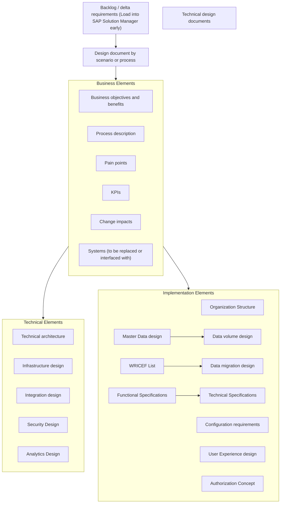

```mermaid
%% Diagram 2: Design Document Flow
flowchart TD
    subgraph BacklogRequirements["Backlog / delta requirements (Load into SAP Solution Manager early)"]
    end
    
    subgraph DesignDoc["Design document by scenario or process"]
    end
    
    subgraph BusinessElements["Business Elements"]
        B1["Business objectives and benefits"]
        B2["Process description"]
        B3["Pain points"]
        B4["KPIs"]
        B5["Change impacts"]
        B6["Systems (to be replaced or interfaced with)"]
    end
    
    subgraph TechnicalElements["Technical Elements"]
        T1["Technical architecture"]
        T2["Infrastructure design"]
        T3["Integration design"]
        T4["Security Design"]
        T5["Analytics Design"]
    end
    
    subgraph ImplementationElements["Implementation Elements"]
        I1["Organization Structure"]
        I2["Configuration requirements"]
        I3["User Experience design"]
        I4["Authorization Concept"]
        I5["Master Data design"]
        I6["WRICEF List"]
        I7["Functional Specifications"]
        
        I5 --> DVdesign["Data volume design"]
        I6 --> DMdesign["Data migration design"]
        I7 --> TechSpecs["Technical Specifications"]
    end
    
    BacklogRequirements --> DesignDoc
    DesignDoc --> BusinessElements
    BusinessElements --> TechnicalElements
    BusinessElements --> ImplementationElements
    
    %% Note at bottom
    note["Technical design documents"]
```
