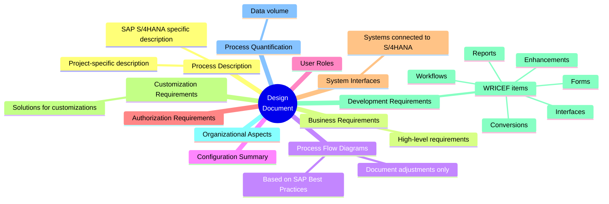

```mermaid
mindmap
  root((Design<br>Document))
    Process Description
      Project-specific description
      SAP S/4HANA specific description
    Business Requirements
      High-level requirements
    Process Flow Diagrams
      Based on SAP Best Practices
      Document adjustments only
    Configuration Summary
    User Roles
    Authorization Requirements
    System Interfaces
      Systems connected to S/4HANA
    Customization Requirements
      Solutions for customizations
    Development Requirements
      WRICEF items
        Workflows
        Reports
        Interfaces
        Conversions
        Enhancements
        Forms
    Organizational Aspects
    Process Quantification
      Data volume
```
