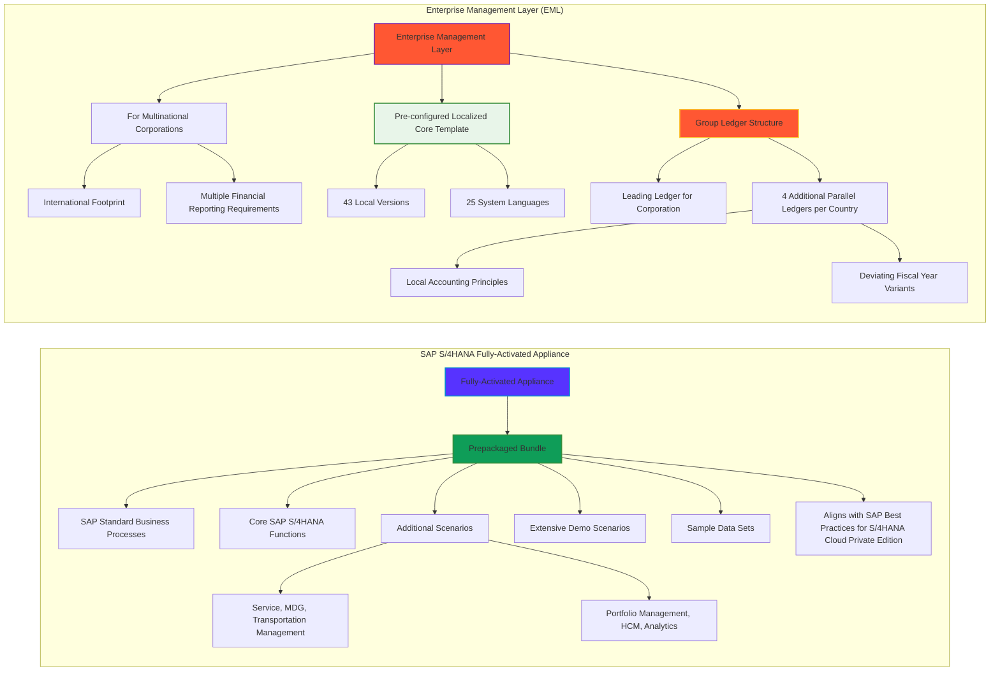

```mermaid
graph LR
    subgraph "SAP S/4HANA Fully-Activated Appliance"
        A[Fully-Activated Appliance] --> B[Prepackaged Bundle]
        B --> C[SAP Standard Business Processes]
        B --> D[Core SAP S/4HANA Functions]
        B --> E[Additional Scenarios]
        E --> F[Service, MDG, Transportation Management]
        E --> G[Portfolio Management, HCM, Analytics]
        B --> H[Extensive Demo Scenarios]
        B --> I[Sample Data Sets]
        B --> J[Aligns with SAP Best Practices for S/4HANA Cloud Private Edition]
    end
    
    subgraph "Enterprise Management Layer (EML)"
        K[Enterprise Management Layer] --> L[For Multinational Corporations]
        L --> M[International Footprint]
        L --> N[Multiple Financial Reporting Requirements]
        K --> O[Pre-configured Localized Core Template]
        O --> P[43 Local Versions]
        O --> Q[25 System Languages]
        K --> R[Group Ledger Structure]
        R --> S[Leading Ledger for Corporation]
        R --> T[4 Additional Parallel Ledgers per Country]
        T --> U[Local Accounting Principles]
        T --> V[Deviating Fiscal Year Variants]
    end
    
    style A fill:#5733FF,stroke:#0288d1,stroke-width:2px
    style K fill:#FF5733,stroke:#7b1fa2,stroke-width:2px
    style B fill:#0F9D58,stroke:#388e3c,stroke-width:2px
    style O fill:#e8f5e9,stroke:#388e3c,stroke-width:2px
    style R fill:#FF5733,stroke:#fbc02d,stroke-width:2px
```
