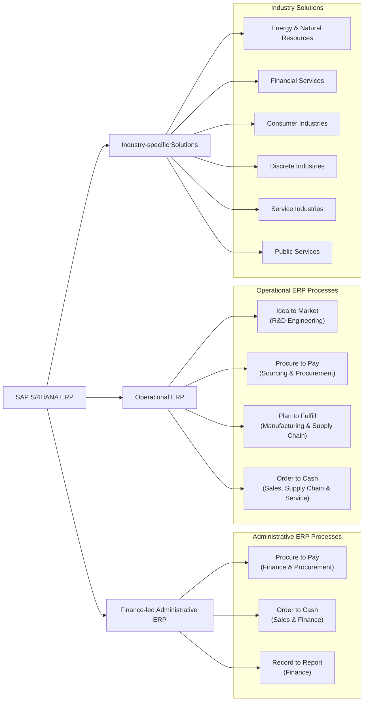

```mermaid
flowchart LR
    erp["SAP S/4HANA ERP"]
    
    erp --> admin["Finance-led Administrative ERP"]
    erp --> op["Operational ERP"]
    
    subgraph "Administrative ERP Processes"
        p2p1["Procure to Pay<br/>(Finance & Procurement)"]
        o2c1["Order to Cash<br/>(Sales & Finance)"]
        r2r["Record to Report<br/>(Finance)"]
    end
    
    admin --> p2p1
    admin --> o2c1
    admin --> r2r
    
    subgraph "Operational ERP Processes"
        i2m["Idea to Market<br/>(R&D Engineering)"]
        p2p2["Procure to Pay<br/>(Sourcing & Procurement)"]
        p2f["Plan to Fulfill<br/>(Manufacturing & Supply Chain)"]
        o2c2["Order to Cash<br/>(Sales, Supply Chain & Service)"]
    end
    
    op --> i2m
    op --> p2p2
    op --> p2f
    op --> o2c2
    
    subgraph "Industry Solutions"
        enr["Energy & Natural Resources"]
        fs["Financial Services"]
        ci["Consumer Industries"]
        di["Discrete Industries"]
        si["Service Industries"]
        ps["Public Services"]
    end
    
    erp --> ind["Industry-specific Solutions"]
    ind --> enr
    ind --> fs
    ind --> ci
    ind --> di
    ind --> si
    ind --> ps
```
