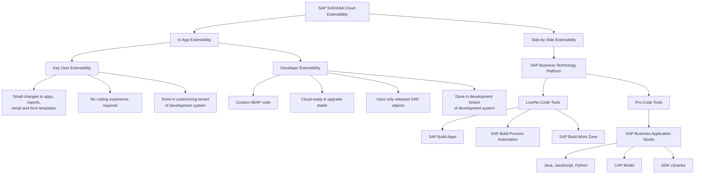

```mermaid
flowchart TD
    A[SAP S/4HANA Cloud Extensibility] --> B[In-App Extensibility]
    A --> C[Side-by-Side Extensibility]
    
    B --> D[Key User Extensibility]
    B --> E[Developer Extensibility]
    
    D --> D1[Small changes to apps, reports,\nemail and form templates]
    D --> D2[No coding experience required]
    D --> D3[Done in customizing tenant\nof development system]
    
    E --> E1[Custom ABAP code]
    E --> E2[Cloud-ready & upgrade-stable]
    E --> E3[Uses only released SAP objects]
    E --> E4[Done in development tenant\nof development system]
    
    C --> F[SAP Business Technology Platform]
    F --> G[Low/No-Code Tools]
    F --> H[Pro-Code Tools]
    
    G --> G1[SAP Build Apps]
    G --> G2[SAP Build Process Automation] 
    G --> G3[SAP Build Work Zone]
    
    H --> H1[SAP Business Application Studio]
    H1 --> H2[Java, JavaScript, Python] 
    H1 --> H3[CAP Model]
    H1 --> H4[SDK Libraries]
```
