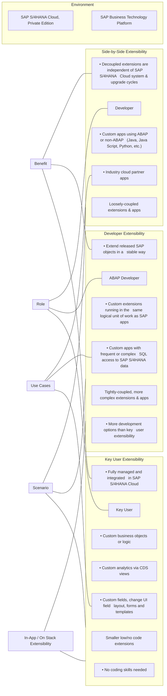

```mermaid
%% Diagram 2: SAP S/4HANA Extensibility Options
flowchart LR
    title2["In-App / On Stack Extensibility"]
    
    subgraph KeyUser["Key User Extensibility"]
        KU_Title["Smaller low/no code extensions"]
        KU_Use1["• Custom fields, change UI field   layout, forms and templates"]
        KU_Use2["• Custom business objects or logic"]
        KU_Use3["• Custom analytics via CDS views"]
        KU_Role["Key User"]
        KU_Benefit1["• Fully managed and integrated   in SAP S/4HANA Cloud"]
        KU_Benefit2["• No coding skills needed"]
    end
    
    subgraph Developer["Developer Extensibility"]
        Dev_Title["Tightly-coupled, more complex extensions & apps"]
        Dev_Use1["• Custom apps with frequent or complex   SQL access to SAP S/4HANA data"]
        Dev_Use2["• Custom extensions running in the   same logical unit of work as SAP apps"]
        Dev_Role["ABAP Developer"]
        Dev_Benefit1["• Extend released SAP objects in a   stable way"]
        Dev_Benefit2["• More development options than key   user extensibility"]
    end
    
    subgraph SideBySide["Side-by-Side Extensibility"]
        SBS_Title["Loosely-coupled extensions & apps"]
        SBS_Use1["• Industry cloud partner apps"]
        SBS_Use2["• Custom apps using ABAP or non-ABAP   (Java, Java Script, Python, etc.)"]
        SBS_Role["Developer"]
        SBS_Benefit["• Decoupled extensions are   independent of SAP S/4HANA   Cloud system & upgrade cycles"]
    end
    
    subgraph Scenario["Scenario"]
    end
    
    subgraph UseCases["Use Cases"]
    end
    
    subgraph Role["Role"]
    end
    
    subgraph Benefit["Benefit"]
    end
    
    subgraph Environment["Environment"]
        Env_SAPS4["SAP S/4HANA Cloud, Private Edition"]
        Env_BTP["SAP Business Technology Platform"]
    end
    
    Scenario --- KeyUser
    Scenario --- Developer
    Scenario --- SideBySide
    
    UseCases --- KU_Use1
    UseCases --- Dev_Use1
    UseCases --- SBS_Use1
    
    Role --- KU_Role
    Role --- Dev_Role
    Role --- SBS_Role
    
    Benefit --- KU_Benefit1
    Benefit --- Dev_Benefit1
    Benefit --- SBS_Benefit
    
    Environment --- Env_SAPS4
    Environment --- Env_BTP
    
    title2 --- KeyUser
    title2 --- Developer

```
