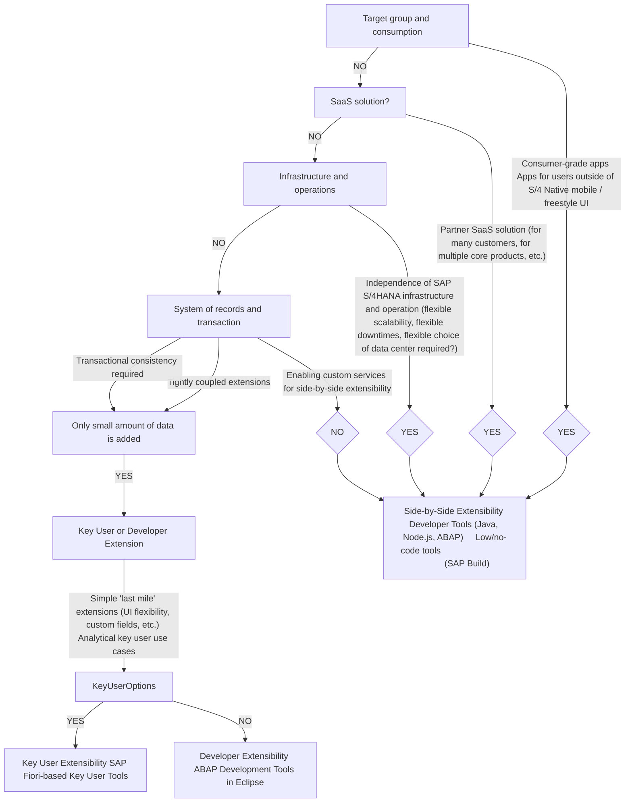

```mermaid
%% Diagram 3: Extensibility Decision Flow
flowchart TD
    Target["Target group and consumption"] --> |"Consumer-grade apps Apps for users outside of S/4 Native mobile / freestyle UI"| Target_Yes{YES}
    Target --> |NO| SaaS["SaaS solution?"]
    
    SaaS --> |"Partner SaaS solution (for many customers, for multiple core products, etc.)"| SaaS_Yes{YES}
    SaaS --> |NO| Infra["Infrastructure and operations"]
    
    Infra --> |"Independence of SAP S/4HANA infrastructure and operation (flexible scalability, flexible downtimes, flexible choice of data center required?)"| Infra_Yes{YES}
    Infra --> |NO| System["System of records and transaction"]
    
    System --> |"Tightly coupled extensions"| System_Options["Only small amount of data is added"]
    System --> |"Transactional consistency required"| System_Options
    System --> |"Enabling custom services for side-by-side extensibility"| System_No{NO}
    
    System_Options --> |YES| KeyUser["Key User or Developer Extension"]
    
    KeyUser --> |"Simple 'last mile' extensions (UI flexibility, custom fields, etc.) Analytical key user use cases"| KeyUserOptions
    KeyUserOptions --> |YES| KeyUserExt["Key User Extensibility SAP Fiori-based Key User Tools"]
    KeyUserOptions --> |NO| DevExt["Developer Extensibility ABAP Development Tools in Eclipse"]
    
    Target_Yes --> SideBySide["Side-by-Side Extensibility Developer Tools (Java, Node.js, ABAP)     Low/no-code tools                                      (SAP Build)"]
    SaaS_Yes --> SideBySide
    Infra_Yes --> SideBySide
    System_No --> SideBySide

```
