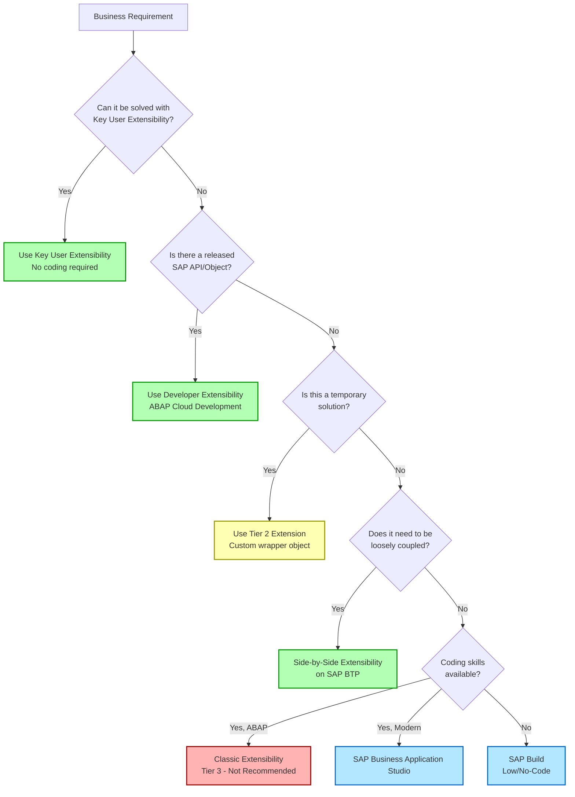

```mermaid
graph TD
    A[Business Requirement] --> B{Can it be solved with\nKey User Extensibility?}
    B -->|Yes| C[Use Key User Extensibility\nNo coding required]
    B -->|No| D{Is there a released\nSAP API/Object?}
    
    D -->|Yes| E[Use Developer Extensibility\nABAP Cloud Development]
    D -->|No| F{Is this a temporary\nsolution?}
    
    F -->|Yes| G[Use Tier 2 Extension\nCustom wrapper object]
    F -->|No| H{Does it need to be\nloosely coupled?}
    
    H -->|Yes| I[Side-by-Side Extensibility\non SAP BTP]
    H -->|No| J{Coding skills\navailable?}
    
    J -->|Yes, ABAP| K[Classic Extensibility\nTier 3 - Not Recommended]
    J -->|Yes, Modern| L[SAP Business Application Studio]
    J -->|No| M[SAP Build\nLow/No-Code]
    
    style C fill:#b3ffb3,stroke:#009900,stroke-width:2px
    style E fill:#b3ffb3,stroke:#009900,stroke-width:2px
    style G fill:#ffffb3,stroke:#999900,stroke-width:2px
    style I fill:#b3ffb3,stroke:#009900,stroke-width:2px
    style K fill:#ffb3b3,stroke:#990000,stroke-width:2px
    style L fill:#b3e6ff,stroke:#0066cc,stroke-width:2px
    style M fill:#b3e6ff,stroke:#0066cc,stroke-width:2px
```
