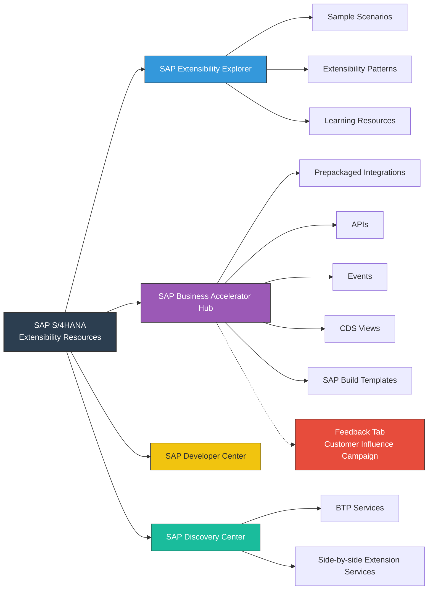

```mermaid
flowchart LR
    Root["SAP S/4HANA<br>Extensibility Resources"]
    
    Root --> EE["SAP Extensibility Explorer"]
    Root --> BAH["SAP Business Accelerator Hub"]
    Root --> SDC["SAP Developer Center"]
    Root --> DC["SAP Discovery Center"]
    
    EE --> EE1["Sample Scenarios"]
    EE --> EE2["Extensibility Patterns"]
    EE --> EE3["Learning Resources"]
    
    BAH --> BAH1["Prepackaged Integrations"]
    BAH --> BAH2["APIs"]
    BAH --> BAH3["Events"]
    BAH --> BAH4["CDS Views"]
    BAH --> BAH5["SAP Build Templates"]
    
    BAH -.-> BAHFeedback["Feedback Tab<br>Customer Influence Campaign"]
    
    DC --> DC1["BTP Services"]
    DC --> DC2["Side-by-side Extension Services"]
    
    style Root fill:#2c3e50,stroke:#333,stroke-width:2px,color:white
    style EE fill:#3498db,stroke:#333,stroke-width:1px,color:white
    style BAH fill:#9b59b6,stroke:#333,stroke-width:1px,color:white
    style SDC fill:#f1c40f,stroke:#333,stroke-width:1px
    style DC fill:#1abc9c,stroke:#333,stroke-width:1px,color:white
    style BAHFeedback fill:#e74c3c,stroke:#333,stroke-width:1px,color:white
```
