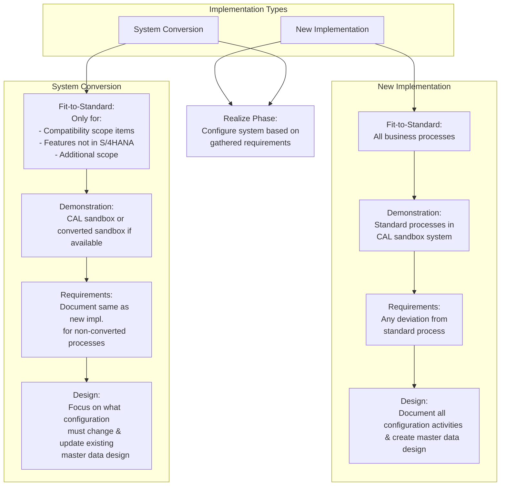

```mermaid
graph TD
    subgraph "Implementation Types"
        newImpl["New Implementation"]
        sysConv["System Conversion"]
    end
    
    subgraph "New Implementation"
        newImpl --> niFts["Fit-to-Standard:
        All business processes"]
        
        niFts --> niDemo["Demonstration:
        Standard processes in 
        CAL sandbox system"]
        
        niDemo --> niReq["Requirements:
        Any deviation from
        standard process"]
        
        niReq --> niDesign["Design:
        Document all 
        configuration activities
        & create master data design"]
    end
    
    subgraph "System Conversion"
        sysConv --> scFts["Fit-to-Standard:
        Only for:
        - Compatibility scope items
        - Features not in S/4HANA
        - Additional scope"]
        
        scFts --> scDemo["Demonstration:
        CAL sandbox or
        converted sandbox if available"]
        
        scDemo --> scReq["Requirements:
        Document same as new impl.
        for non-converted processes"]
        
        scReq --> scDesign["Design:
        Focus on what configuration
        must change & update existing
        master data design"]
    end
    
    newImpl & sysConv --> realize["Realize Phase:
    Configure system based on
    gathered requirements"]
```
