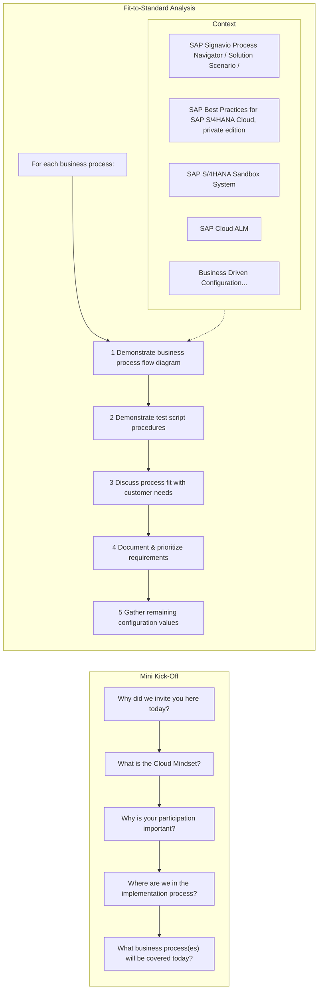

```mermaid
%% Diagram 1: Mini Kick-Off and Fit-to-Standard Analysis
flowchart LR
    subgraph KickOff["Mini Kick-Off"]
        K1["Why did we invite you here today?"]
        K2["What is the Cloud Mindset?"]
        K3["Why is your participation important?"]
        K4["Where are we in the implementation process?"]
        K5["What business process(es) will be covered today?"]
        K1 --> K2 --> K3 --> K4 --> K5
    end

    subgraph FitToStandard["Fit-to-Standard Analysis"]
        title["For each business process:"]
        step1["1 Demonstrate business process flow diagram"]
        step2["2 Demonstrate test script procedures"]
        step3["3 Discuss process fit with customer needs"]
        step4["4 Document & prioritize requirements"]
        step5["5 Gather remaining configuration values"]
        
        title --> step1 --> step2 --> step3 --> step4 --> step5
        
        subgraph Context
            C1["SAP Signavio Process Navigator / Solution Scenario /"]
            C2["SAP Best Practices for SAP S/4HANA Cloud, private edition"]
            C3["SAP S/4HANA Sandbox System"]
            C4["SAP Cloud ALM"]
            C5["Business Driven Configuration..."]
        end
        
        Context -.-> step1
    end
```
