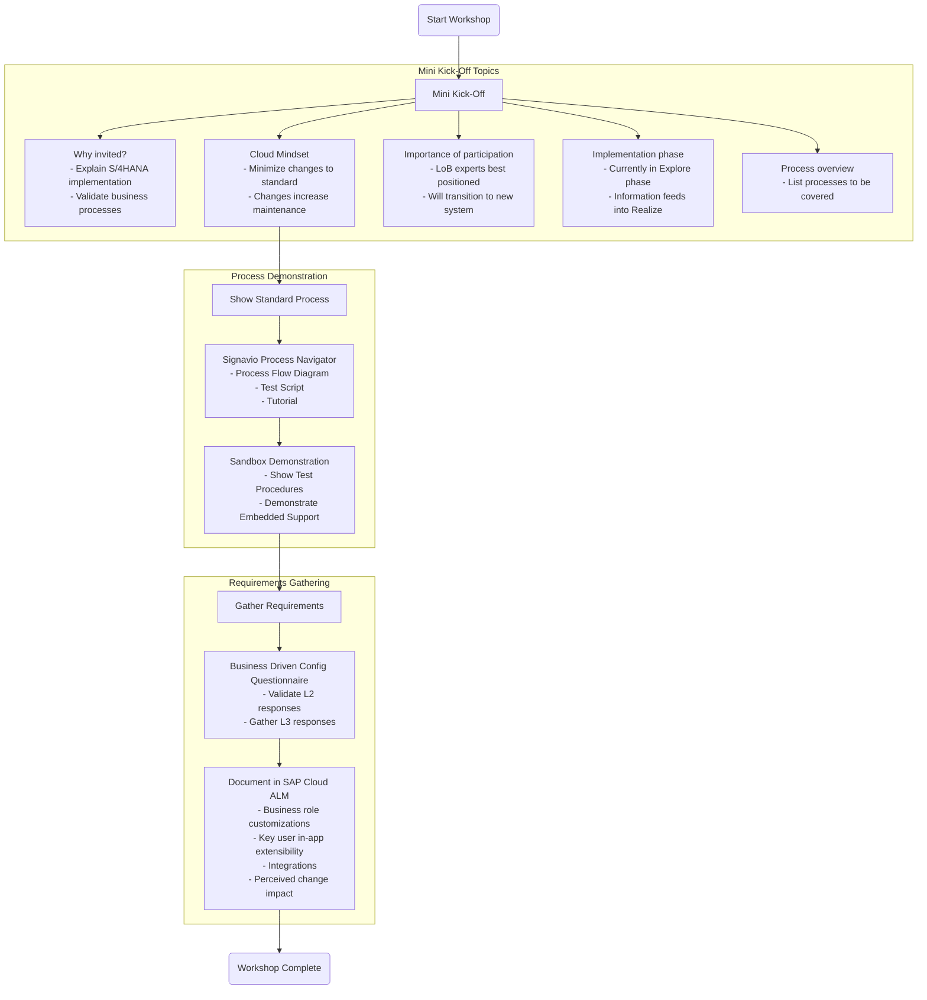

```mermaid
flowchart TD
    start(Start Workshop) --> kickoff[Mini Kick-Off]
    
    subgraph "Mini Kick-Off Topics"
        kickoff --> why["Why invited?
        - Explain S/4HANA implementation
        - Validate business processes"]
        kickoff --> cloud["Cloud Mindset
        - Minimize changes to standard
        - Changes increase maintenance"]
        kickoff --> importance["Importance of participation
        - LoB experts best positioned
        - Will transition to new system"]
        kickoff --> phase["Implementation phase
        - Currently in Explore phase
        - Information feeds into Realize"]
        kickoff --> processes["Process overview
        - List processes to be covered"]
    end
    
    cloud --> standardProcess[Show Standard Process]
    
    subgraph "Process Demonstration"
        standardProcess --> signavio["Signavio Process Navigator
        - Process Flow Diagram
        - Test Script
        - Tutorial"]
        
        signavio --> sandbox["Sandbox Demonstration
        - Show Test Procedures
        - Demonstrate Embedded Support"]
    end
    
    sandbox --> requirements[Gather Requirements]
    
    subgraph "Requirements Gathering"
        requirements --> bdcq["Business Driven Config Questionnaire
        - Validate L2 responses
        - Gather L3 responses"]
        
        bdcq --> alm["Document in SAP Cloud ALM
        - Business role customizations
        - Key user in-app extensibility
        - Integrations
        - Perceived change impact"]
    end
    
    alm --> complete(Workshop Complete)
```
