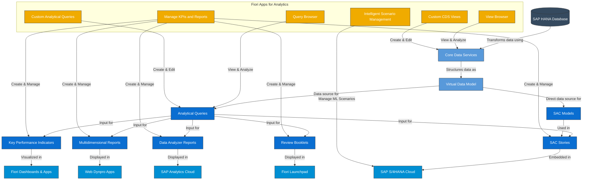

```mermaid
flowchart TD
    DB[(SAP HANA Database)] -->|Transforms data using| CDS[Core Data Services]
    CDS -->|Structures data as| VDM[Virtual Data Model]
    VDM -->|Data source for| AQ[Analytical Queries]
    VDM -->|Direct data source for| SACM[SAC Models]
    
    AQ -->|Input for| KPI[Key Performance Indicators]
    AQ -->|Input for| MDR[Multidimensional Reports]
    AQ -->|Input for| DAR[Data Analyzer Reports]
    AQ -->|Input for| RB[Review Booklets]
    AQ -->|Input for| SACS[SAC Stories]
    
    KPI -->|Visualized in| FDA[Fiori Dashboards & Apps]
    MDR -->|Displayed in| WD[Web Dynpro Apps]
    DAR -->|Displayed in| SAC[SAP Analytics Cloud]
    RB -->|Displayed in| FLP[Fiori Launchpad]
    SACS -->|Embedded in| S4H[SAP S/4HANA Cloud]
    
    SACM -->|Used in| SACS
    
    subgraph "Fiori Apps for Analytics"
        VB[View Browser]
        CCV[Custom CDS Views]
        QB[Query Browser]
        CAQ[Custom Analytical Queries]
        MKR[Manage KPIs and Reports]
        ISM[Intelligent Scenario Management]
    end
    
    VB -->|View & Analyze| CDS
    CCV -->|Create & Edit| CDS
    QB -->|View & Analyze| AQ
    CAQ -->|Create & Edit| AQ
    MKR -->|Create & Manage| KPI
    MKR -->|Create & Manage| DAR
    MKR -->|Create & Manage| MDR
    MKR -->|Create & Manage| RB
    MKR -->|Create & Manage| SACS
    ISM -->|Manage ML Scenarios| S4H
    
    classDef database fill:#354a5f,stroke:#333,stroke-width:1px,color:white;
    classDef transformation fill:#5899da,stroke:#333,stroke-width:1px,color:white;
    classDef analysis fill:#0a6ed1,stroke:#333,stroke-width:1px,color:white;
    classDef visualization fill:#008fd3,stroke:#333,stroke-width:1px,color:white;
    classDef apps fill:#f0ab00,stroke:#333,stroke-width:1px,color:white;
    
    class DB database;
    class CDS,VDM transformation;
    class AQ,KPI,MDR,DAR,RB,SACS,SACM analysis;
    class FDA,WD,SAC,FLP,S4H visualization;
    class VB,CCV,QB,CAQ,MKR,ISM apps;
```
