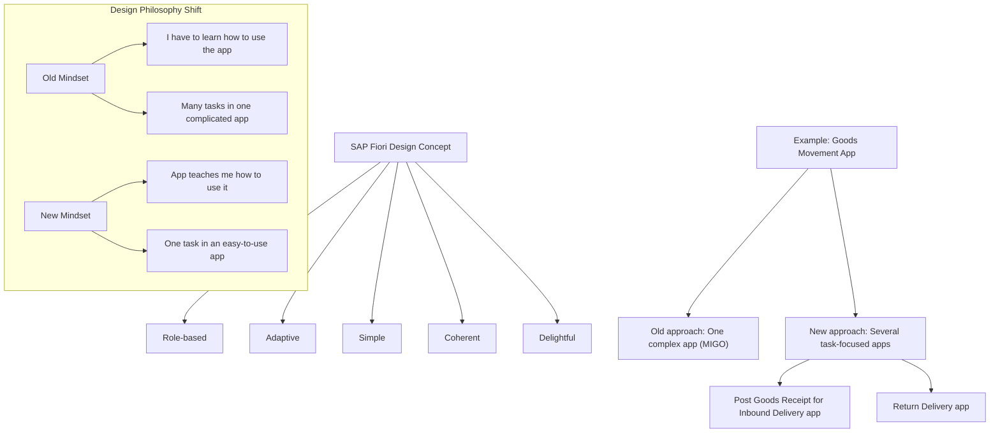

```mermaid
flowchart TD
    A[SAP Fiori Design Concept] --> B[Role-based]
    A --> C[Adaptive]
    A --> D[Simple]
    A --> E[Coherent]
    A --> F[Delightful]
    
    subgraph "Design Philosophy Shift"
    G[Old Mindset] --> G1["I have to learn how to use the app"]
    G --> G2["Many tasks in one complicated app"]
    H[New Mindset] --> H1["App teaches me how to use it"]
    H --> H2["One task in an easy-to-use app"]
    end
    
    I[Example: Goods Movement App]
    I --> I1["Old approach: One complex app (MIGO)"]
    I --> I2["New approach: Several task-focused apps"]
    I2 --> I21["Post Goods Receipt for Inbound Delivery app"]
    I2 --> I22["Return Delivery app"]
```
