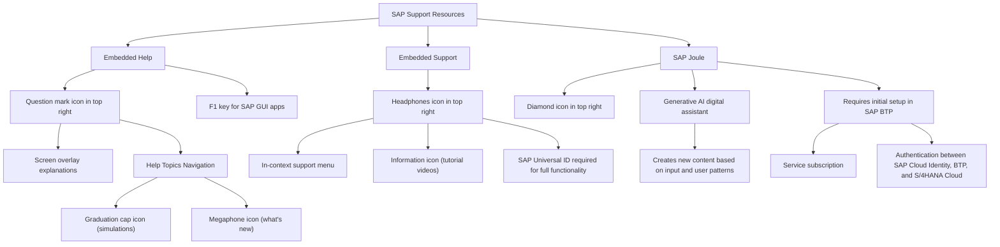

```mermaid
flowchart TD
    A[SAP Support Resources] --> B[Embedded Help]
    A --> C[Embedded Support]
    A --> D[SAP Joule]
    
    B --> B1["Question mark icon in top right"]
    B --> B2["F1 key for SAP GUI apps"]
    B1 --> B11["Screen overlay explanations"]
    B1 --> B12[Help Topics Navigation]
    B12 --> B121["Graduation cap icon (simulations)"]
    B12 --> B122["Megaphone icon (what's new)"]
    
    C --> C1["Headphones icon in top right"]
    C1 --> C11["In-context support menu"]
    C1 --> C12["Information icon (tutorial videos)"]
    C1 --> C13["SAP Universal ID required for full functionality"]
    
    D --> D1["Diamond icon in top right"]
    D --> D2["Generative AI digital assistant"]
    D2 --> D21["Creates new content based on input and user patterns"]
    D --> D3["Requires initial setup in SAP BTP"]
    D3 --> D31["Service subscription"]
    D3 --> D32["Authentication between SAP Cloud Identity, BTP, and S/4HANA Cloud"]
```
