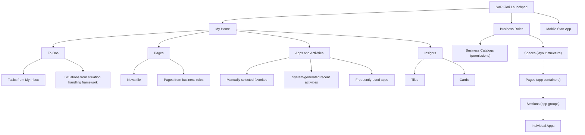

```mermaid
flowchart TD
    A[SAP Fiori Launchpad] --> B[My Home]
    A --> C[Business Roles]
    A --> D[Mobile Start App]
    
    B --> B1[To-Dos]
    B1 --> B11["Tasks from My Inbox"]
    B1 --> B12["Situations from situation handling framework"]
    
    B --> B2[Pages]
    B2 --> B21["News tile"]
    B2 --> B22["Pages from business roles"]
    
    B --> B3["Apps and Activities"]
    B3 --> B31["Manually selected favorites"]
    B3 --> B32["System-generated recent activities"]
    B3 --> B33["Frequently-used apps"]
    
    B --> B4[Insights]
    B4 --> B41[Tiles]
    B4 --> B42[Cards]
    
    C --> C1["Business Catalogs (permissions)"]
    C --> C2["Spaces (layout structure)"]
    C2 --> C21["Pages (app containers)"]
    C21 --> C211["Sections (app groups)"]
    C211 --> C2111["Individual Apps"]
```
