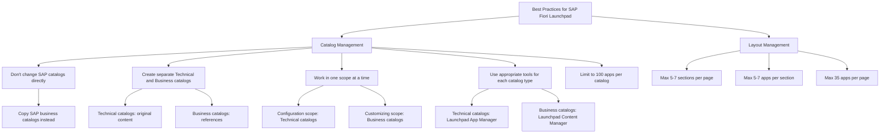

```mermaid
graph TD
    A[Best Practices for SAP Fiori Launchpad] --> B[Catalog Management]
    A --> C[Layout Management]
    
    B --> D[Don't change SAP catalogs directly]
    B --> E[Create separate Technical and Business catalogs]
    B --> F[Work in one scope at a time]
    B --> G[Use appropriate tools for each catalog type]
    B --> H[Limit to 100 apps per catalog]
    
    D --> I[Copy SAP business catalogs instead]
    E --> J[Technical catalogs: original content]
    E --> K[Business catalogs: references]
    F --> L[Configuration scope: Technical catalogs]
    F --> M[Customizing scope: Business catalogs]
    G --> N[Technical catalogs: Launchpad App Manager]
    G --> O[Business catalogs: Launchpad Content Manager]
    
    C --> P[Max 5-7 sections per page]
    C --> Q[Max 5-7 apps per section]
    C --> R[Max 35 apps per page]
```
