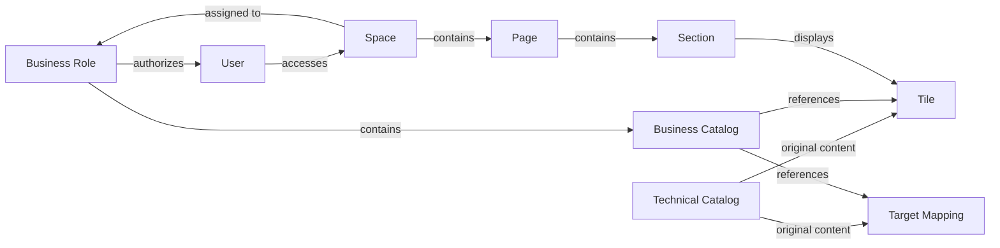

```mermaid
flowchart LR
    A[Technical Catalog] --> |original content| B[Tile]
    A --> |original content| C[Target Mapping]
    
    D[Business Catalog] --> |references| B
    D --> |references| C
    
    E[Business Role] --> |contains| D
    
    F[Space] --> |assigned to| E
    F --> |contains| G[Page]
    G --> |contains| H[Section]
    H --> |displays| B
    
    E --> |authorizes| I[User]
    I --> |accesses| F
```
