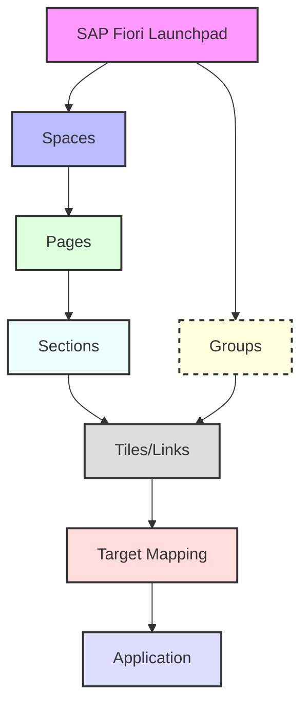

```mermaid
flowchart TD
    Launchpad[SAP Fiori Launchpad] --> Spaces[Spaces]
    Launchpad --> Groups[Groups]
    Spaces --> Pages[Pages]
    Pages --> Sections[Sections]
    Sections --> TilesLinks[Tiles/Links]
    Groups --> TilesLinks
    TilesLinks --> TargetMapping[Target Mapping]
    TargetMapping --> App[Application]
    
    style Launchpad fill:#f9f,stroke:#333,stroke-width:2px
    style Spaces fill:#bbf,stroke:#333,stroke-width:2px
    style Groups fill:#ffd,stroke:#333,stroke-width:2px,stroke-dasharray: 5 5
    style Pages fill:#dfd,stroke:#333,stroke-width:2px
    style Sections fill:#eff,stroke:#333,stroke-width:2px
    style TilesLinks fill:#ddd,stroke:#333,stroke-width:2px
    style TargetMapping fill:#fdd,stroke:#333,stroke-width:2px
    style App fill:#ddf,stroke:#333,stroke-width:2px
    
    classDef deprecated fill:#ffd,stroke:#333,stroke-width:2px,stroke-dasharray: 5 5
    class Groups deprecated
```
