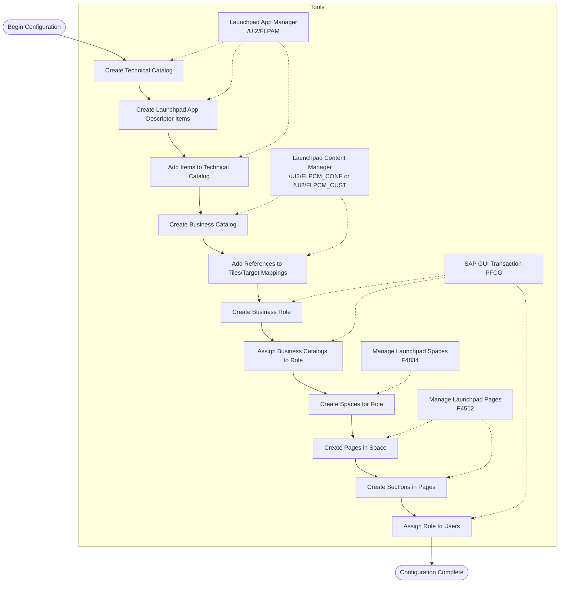

```mermaid
flowchart TB
    Start([Begin Configuration]) --> A[Create Technical Catalog]
    A --> B[Create Launchpad App Descriptor Items]
    B --> C[Add Items to Technical Catalog]
    C --> D[Create Business Catalog]
    D --> E[Add References to Tiles/Target Mappings]
    E --> F[Create Business Role]
    F --> G[Assign Business Catalogs to Role]
    G --> H[Create Spaces for Role]
    H --> I[Create Pages in Space]
    I --> J[Create Sections in Pages]
    J --> K[Assign Role to Users]
    K --> End([Configuration Complete])
    
    subgraph "Tools"
    L[Launchpad App Manager\n/UI2/FLPAM] -.-> A
    L -.-> B
    L -.-> C
    M[Launchpad Content Manager\n/UI2/FLPCM_CONF or /UI2/FLPCM_CUST] -.-> D
    M -.-> E
    N[SAP GUI Transaction PFCG] -.-> F
    N -.-> G
    N -.-> K
    O[Manage Launchpad Spaces\nF4834] -.-> H
    P[Manage Launchpad Pages\nF4512] -.-> I
    P -.-> J
    end
```
