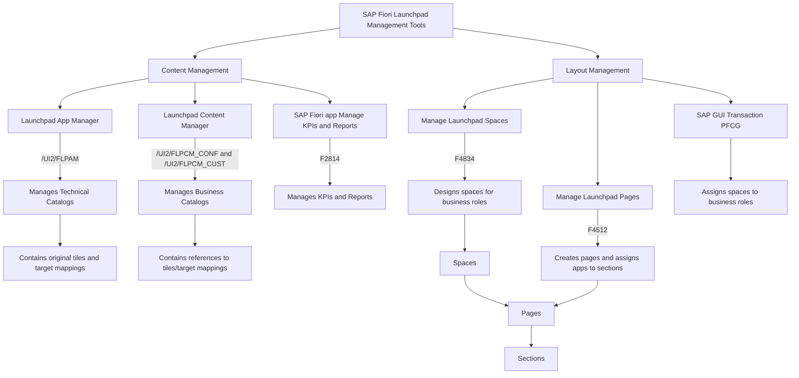

```mermaid
flowchart TD
    A[SAP Fiori Launchpad Management Tools] --> B[Content Management]
    A --> C[Layout Management]
    
    B --> D[Launchpad App Manager]
    B --> E[Launchpad Content Manager]
    B --> F[SAP Fiori app Manage KPIs and Reports]
    
    C --> G[Manage Launchpad Spaces]
    C --> H[Manage Launchpad Pages]
    C --> I[SAP GUI Transaction PFCG]
    
    D -- "/UI2/FLPAM" --> J[Manages Technical Catalogs]
    E -- "/UI2/FLPCM_CONF and /UI2/FLPCM_CUST" --> K[Manages Business Catalogs]
    F -- "F2814" --> L[Manages KPIs and Reports]
    
    G -- "F4834" --> M[Designs spaces for business roles]
    H -- "F4512" --> N[Creates pages and assigns apps to sections]
    I --> O[Assigns spaces to business roles]
    
    J --> P[Contains original tiles and target mappings]
    K --> Q[Contains references to tiles/target mappings]
    
    M --> R[Spaces]
    N --> S[Pages]
    R --> S
    S --> T[Sections]
```
