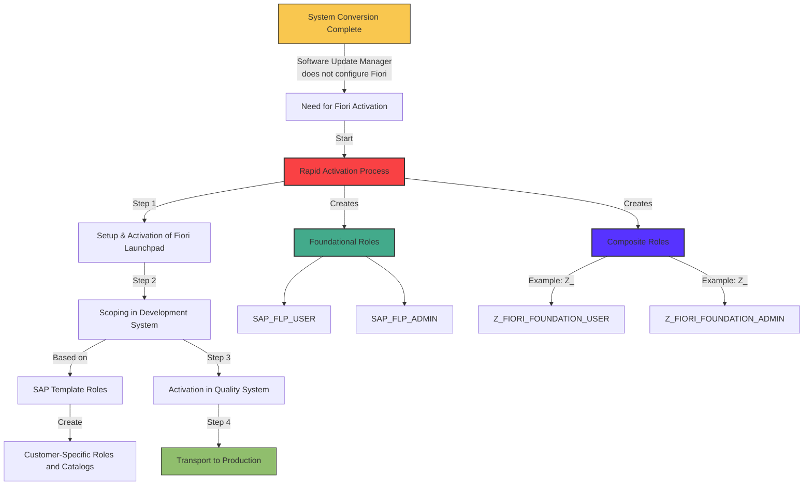

```mermaid
flowchart TD
    A[System Conversion Complete] -->|"Software Update Manager\ndoes not configure Fiori"| B[Need for Fiori Activation]
    B -->|"Start"| C[Rapid Activation Process]
    
    C -->|"Step 1"| D[Setup & Activation of Fiori Launchpad]
    D -->|"Step 2"| E[Scoping in Development System]
    E -->|"Based on"| F[SAP Template Roles]
    F -->|"Create"| G[Customer-Specific Roles and Catalogs]
    E -->|"Step 3"| H[Activation in Quality System]
    H -->|"Step 4"| I[Transport to Production]
    
    C -->|"Creates"| J[Foundational Roles]
    J --> K[SAP_FLP_USER]
    J --> L[SAP_FLP_ADMIN]
    
    C -->|"Creates"| M[Composite Roles]
    M -->|"Example: Z_"| N[Z_FIORI_FOUNDATION_USER]
    M -->|"Example: Z_"| O[Z_FIORI_FOUNDATION_ADMIN]
    
    style A fill:#f9c74f,stroke:#333,stroke-width:1px
    style I fill:#90be6d,stroke:#333,stroke-width:1px
    style C fill:#f94144,stroke:#333,stroke-width:2px
    style J fill:#43aa8b,stroke:#333,stroke-width:2px
    style M fill:#5733FF,stroke:#333,stroke-width:2px
```
