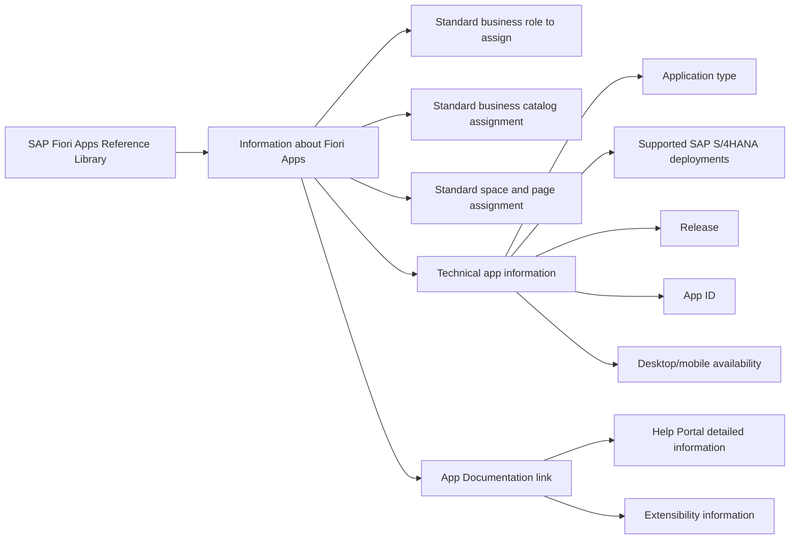

```mermaid
flowchart LR
    A[SAP Fiori Apps Reference Library] --> B["Information about Fiori Apps"]
    B --> B1["Standard business role to assign"]
    B --> B2["Standard business catalog assignment"]
    B --> B3["Standard space and page assignment"]
    B --> B4["Technical app information"]
    B4 --> B41["Application type"]
    B4 --> B42["Supported SAP S/4HANA deployments"]
    B4 --> B43["Release"]
    B4 --> B44["App ID"]
    B4 --> B45["Desktop/mobile availability"]
    B --> B5["App Documentation link"]
    B5 --> B51["Help Portal detailed information"]
    B5 --> B52["Extensibility information"]
```
