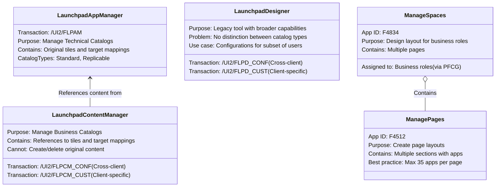

```mermaid
classDiagram
    class LaunchpadAppManager {
        Transaction: /UI2/FLPAM
        Purpose: Manage Technical Catalogs
        Contains: Original tiles and target mappings
        CatalogTypes: Standard, Replicable
    }
    
    class LaunchpadContentManager {
        Transaction: /UI2/FLPCM_CONF (Cross-client)
        Transaction: /UI2/FLPCM_CUST (Client-specific)
        Purpose: Manage Business Catalogs
        Contains: References to tiles and target mappings
        Cannot: Create/delete original content
    }
    
    class LaunchpadDesigner {
        Transaction: /UI2/FLPD_CONF (Cross-client)
        Transaction: /UI2/FLPD_CUST (Client-specific)
        Purpose: Legacy tool with broader capabilities
        Problem: No distinction between catalog types
        Use case: Configurations for subset of users
    }
    
    class ManageSpaces {
        App ID: F4834
        Purpose: Design layout for business roles
        Contains: Multiple pages
        Assigned to: Business roles (via PFCG)
    }
    
    class ManagePages {
        App ID: F4512
        Purpose: Create page layouts
        Contains: Multiple sections with apps
        Best practice: Max 35 apps per page
    }
    
    LaunchpadAppManager <-- LaunchpadContentManager : References content from
    ManageSpaces o-- ManagePages : Contains
```
