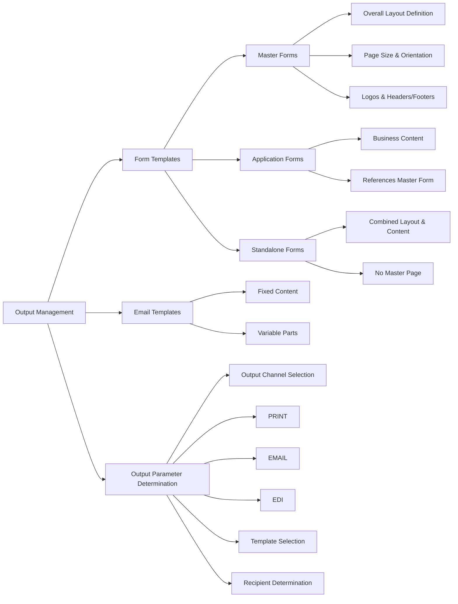

```mermaid
graph LR
    A[Output Management] --> B[Form Templates]
    A --> C[Email Templates]
    A --> D[Output Parameter Determination]
    
    B --> B1[Master Forms]
    B --> B2[Application Forms]
    B --> B3[Standalone Forms]
    
    B1 --> B1a[Overall Layout Definition]
    B1 --> B1b[Page Size & Orientation]
    B1 --> B1c[Logos & Headers/Footers]
    
    B2 --> B2a[Business Content]
    B2 --> B2b[References Master Form]
    
    B3 --> B3a[Combined Layout & Content]
    B3 --> B3b[No Master Page]
    
    C --> C1[Fixed Content]
    C --> C2[Variable Parts]
    
    D --> D1[Output Channel Selection]
    D --> D1a[PRINT]
    D --> D1b[EMAIL]
    D --> D1c[EDI]
    
    D --> D2[Template Selection]
    D --> D3[Recipient Determination]
```
