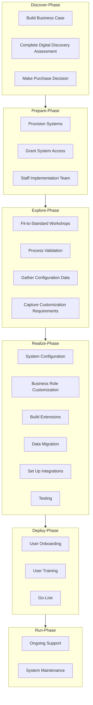

```mermaid
flowchart TD
    subgraph Discover-Phase
        BusinessCase["Build Business Case"]
        DiscoveryAssessment["Complete Digital Discovery Assessment"]
        Purchase["Make Purchase Decision"]
    end
    
    subgraph Prepare-Phase
        Provision["Provision Systems"]
        Access["Grant System Access"]
        StaffTeam["Staff Implementation Team"]
    end
    
    subgraph Explore-Phase
        FitStandard["Fit-to-Standard Workshops"]
        ProcessValidation["Process Validation"]
        ConfigData["Gather Configuration Data"]
        CustomReq["Capture Customization Requirements"]
    end
    
    subgraph Realize-Phase
        Config["System Configuration"]
        RoleCustom["Business Role Customization"]
        Extensions["Build Extensions"]
        DataMigration["Data Migration"]
        Integration["Set Up Integrations"]
        Testing["Testing"]
    end
    
    subgraph Deploy-Phase
        Onboarding["User Onboarding"]
        Training["User Training"]
        GoLive["Go-Live"]
    end
    
    subgraph Run-Phase
        Support["Ongoing Support"]
        Maintenance["System Maintenance"]
    end
    
    Discover-Phase --> Prepare-Phase
    Prepare-Phase --> Explore-Phase
    Explore-Phase --> Realize-Phase
    Realize-Phase --> Deploy-Phase
    Deploy-Phase --> Run-Phase
```
