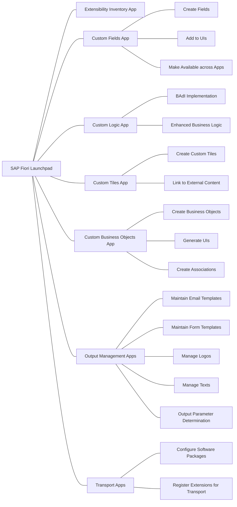

```mermaid
graph LR
    A[SAP Fiori Launchpad] --- B[Extensibility Inventory App]
    A --- C[Custom Fields App]
    A --- D[Custom Logic App]
    A --- E[Custom Tiles App]
    A --- F[Custom Business Objects App]
    A --- G[Output Management Apps]
    A --- H[Transport Apps]
    
    C --- C1[Create Fields]
    C --- C2[Add to UIs]
    C --- C3[Make Available across Apps]
    
    D --- D1[BAdI Implementation]
    D --- D2[Enhanced Business Logic]
    
    E --- E1[Create Custom Tiles]
    E --- E2[Link to External Content]
    
    F --- F1[Create Business Objects]
    F --- F2[Generate UIs]
    F --- F3[Create Associations]
    
    G --- G1[Maintain Email Templates]
    G --- G2[Maintain Form Templates]
    G --- G3[Manage Logos]
    G --- G4[Manage Texts]
    G --- G5[Output Parameter Determination]
    
    H --- H1[Configure Software Packages]
    H --- H2[Register Extensions for Transport]
```
