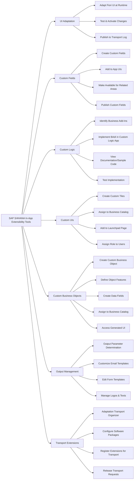

```mermaid
flowchart LR
    A[SAP S/4HANA In-App Extensibility Tools] --> B[UI Adaptation]
    A --> C[Custom Fields]
    A --> D[Custom Logic]
    A --> E[Custom UIs]
    A --> F[Custom Business Objects]
    A --> G[Output Management]
    A --> H[Transport Extensions]
    
    B --> B1[Adapt Fiori UI at Runtime]
    B --> B2[Test & Activate Changes]
    B --> B3[Publish to Transport Log]
    
    C --> C1[Create Custom Fields]
    C --> C2[Add to App UIs]
    C --> C3[Make Available for Related Areas]
    C --> C4[Publish Custom Fields]
    
    D --> D1[Identify Business Add-Ins]
    D --> D2[Implement BAdI in Custom Logic App]
    D --> D3[View Documentation/Sample Code]
    D --> D4[Test Implementation]
    
    E --> E1[Create Custom Tiles]
    E --> E2[Assign to Business Catalog]
    E --> E3[Add to Launchpad Page]
    E --> E4[Assign Role to Users]
    
    F --> F1[Create Custom Business Object]
    F --> F2[Define Object Features]
    F --> F3[Create Data Fields]
    F --> F4[Assign to Business Catalog]
    F --> F5[Access Generated UI]
    
    G --> G1[Output Parameter Determination]
    G --> G2[Customize Email Templates]
    G --> G3[Edit Form Templates]
    G --> G4[Manage Logos & Texts]
    
    H --> H1[Adaptation Transport Organizer]
    H --> H2[Configure Software Packages]
    H --> H3[Register Extensions for Transport]
    H --> H4[Release Transport Requests]
```
